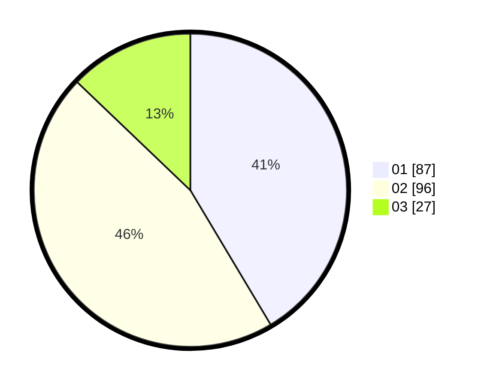

# Hasil

Hasil perolehan suara paslon dapat dilihat pada file paslon-01.txt, paslon-02.txt, dan paslon-03.txt.

Jika tidak ada, artinya data tersebut belum ada pada SIREKAP.

## Perolehan Suara

 * Paslon 01: **87**.
 * Paslon 02: **96**.
 * Paslon 03: **27**.

## Foto C Plano

https://sirekap-obj-formc.kpu.go.id/6527/pemilu/ppwp/31/75/06/10/07/3175061007163-20240214-223425--ab4807b9-b25f-48c6-be1c-2317e04e9b6e.jpg

https://sirekap-obj-formc.kpu.go.id/6527/pemilu/ppwp/31/75/06/10/07/3175061007163-20240214-223446--00f98a46-e3c9-4227-ad5a-55f63b069efd.jpg

https://sirekap-obj-formc.kpu.go.id/6527/pemilu/ppwp/31/75/06/10/07/3175061007163-20240214-223435--18290985-f67e-421f-b1ba-4747f77380f3.jpg

## DATA PEMILIH TETAP

Jumlah pemilih dalam DPT: **256**.
 * L: **134**.
 * P: **122**.

## DATA PENGGUNA HAK PILIH

Jumlah pengguna hak pilih dalam DPT: **215**.
 * L: **112**.
 * P: **103**.

Jumlah pengguna hak pilih dalam DPTb: **0**.
 * L: **0**.
 * P: **0**.

Jumlah pengguna hak pilih dalam DPK: **0**.
 * L: **0**.
 * P: **0**.

Jumlah pengguna hak pilih: **215**.
 * L: **112**.
 * P: **103**.

## JUMLAH SUARA SAH DAN TIDAK SAH

JUMLAH SELURUH SUARA SAH: **210**.

JUMLAH SUARA TIDAK SAH: **5**.

JUMLAH SELURUH SUARA SAH DAN SUARA TIDAK SAH: **215**.
