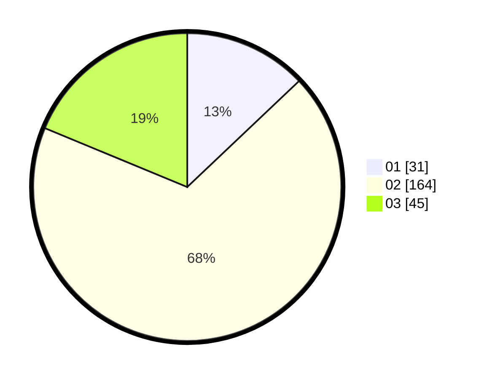

# Hasil

Hasil perolehan suara paslon dapat dilihat pada file paslon-01.txt, paslon-02.txt, dan paslon-03.txt.

Jika tidak ada, artinya data tersebut belum ada pada SIREKAP.

## Perolehan Suara

 * Paslon 01: **31**.
 * Paslon 02: **164**.
 * Paslon 03: **45**.

## Foto C Plano

https://sirekap-obj-formc.kpu.go.id/d43c/pemilu/ppwp/31/75/06/10/07/3175061007169-20240215-000704--a953fde4-a68a-4d15-9efb-502a8b17c781.jpg

https://sirekap-obj-formc.kpu.go.id/d43c/pemilu/ppwp/31/75/06/10/07/3175061007169-20240215-002111--e67791d0-be28-4727-b032-06f5fd1ffe4f.jpg

https://sirekap-obj-formc.kpu.go.id/d43c/pemilu/ppwp/31/75/06/10/07/3175061007169-20240215-002124--a66e03c3-f7e9-424c-be62-28bd541b2300.jpg

## DATA PEMILIH TETAP

Jumlah pemilih dalam DPT: **278**.
 * L: **131**.
 * P: **147**.

## DATA PENGGUNA HAK PILIH

Jumlah pengguna hak pilih dalam DPT: **237**.
 * L: **108**.
 * P: **129**.

Jumlah pengguna hak pilih dalam DPTb: **0**.
 * L: **0**.
 * P: **0**.

Jumlah pengguna hak pilih dalam DPK: **6**.
 * L: **4**.
 * P: **2**.

Jumlah pengguna hak pilih: **243**.
 * L: **112**.
 * P: **131**.

## JUMLAH SUARA SAH DAN TIDAK SAH

JUMLAH SELURUH SUARA SAH: **240**.

JUMLAH SUARA TIDAK SAH: **3**.

JUMLAH SELURUH SUARA SAH DAN SUARA TIDAK SAH: **243**.
