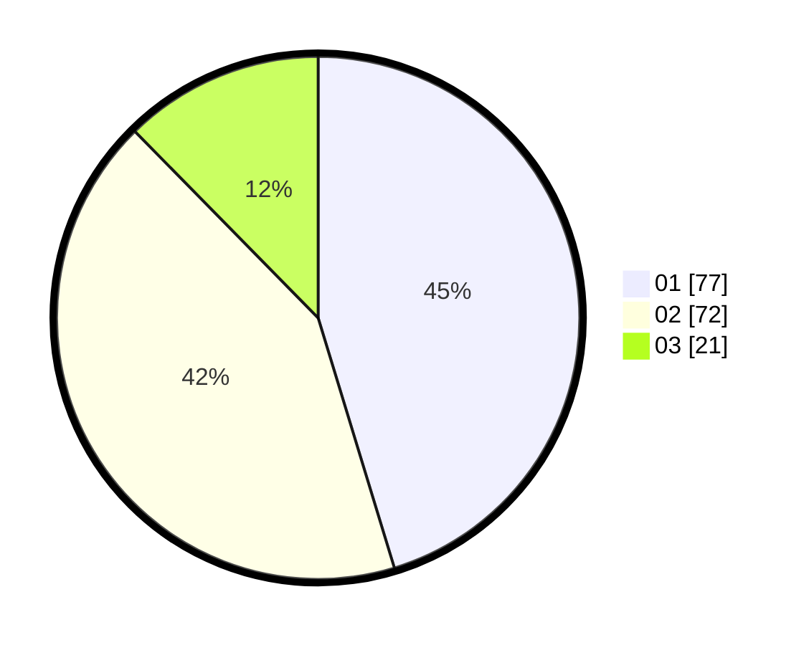

# Hasil

Hasil perolehan suara paslon dapat dilihat pada file paslon-01.txt, paslon-02.txt, dan paslon-03.txt.

Jika tidak ada, artinya data tersebut belum ada pada SIREKAP.

## Perolehan Suara

 * Paslon 01: **77**.
 * Paslon 02: **72**.
 * Paslon 03: **21**.

## Foto C Plano

https://sirekap-obj-formc.kpu.go.id/7d75/pemilu/ppwp/31/75/06/10/07/3175061007175-20240215-202544--41854a19-aaac-4725-840d-6ed0f7c2b84f.jpg

https://sirekap-obj-formc.kpu.go.id/7d75/pemilu/ppwp/31/75/06/10/07/3175061007175-20240215-202554--86fce0f3-3dec-4112-a03e-b4052244230b.jpg

https://sirekap-obj-formc.kpu.go.id/7d75/pemilu/ppwp/31/75/06/10/07/3175061007175-20240215-202546--a0cbf340-ec07-4155-ae28-fac6e71d7086.jpg

## DATA PEMILIH TETAP

Jumlah pemilih dalam DPT: **259**.
 * L: **125**.
 * P: **134**.

## DATA PENGGUNA HAK PILIH

Jumlah pengguna hak pilih dalam DPT: **164**.
 * L: **74**.
 * P: **90**.

Jumlah pengguna hak pilih dalam DPTb: **5**.
 * L: **3**.
 * P: **2**.

Jumlah pengguna hak pilih dalam DPK: **1**.
 * L: **1**.
 * P: **0**.

Jumlah pengguna hak pilih: **170**.
 * L: **78**.
 * P: **92**.

## JUMLAH SUARA SAH DAN TIDAK SAH

JUMLAH SELURUH SUARA SAH: **170**.

JUMLAH SUARA TIDAK SAH: **0**.

JUMLAH SELURUH SUARA SAH DAN SUARA TIDAK SAH: **170**.
