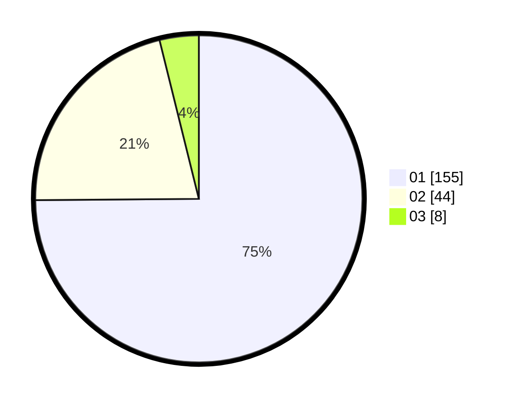

# Hasil

Hasil perolehan suara paslon dapat dilihat pada file paslon-01.txt, paslon-02.txt, dan paslon-03.txt.

Jika tidak ada, artinya data tersebut belum ada pada SIREKAP.

## Perolehan Suara

 * Paslon 01: **155**.
 * Paslon 02: **44**.
 * Paslon 03: **8**.

## Foto C Plano

https://sirekap-obj-formc.kpu.go.id/2947/pemilu/ppwp/31/75/06/10/07/3175061007188-20240214-230149--77e51403-d9f8-4b65-bfa0-ed55e5c48788.jpg

https://sirekap-obj-formc.kpu.go.id/2947/pemilu/ppwp/31/75/06/10/07/3175061007188-20240214-230202--cd3f47cc-2b69-48c3-b8e7-f5fc1f38325c.jpg

https://sirekap-obj-formc.kpu.go.id/2947/pemilu/ppwp/31/75/06/10/07/3175061007188-20240214-230207--b20b9cba-5bce-4d7f-a1bb-80e423095c11.jpg
