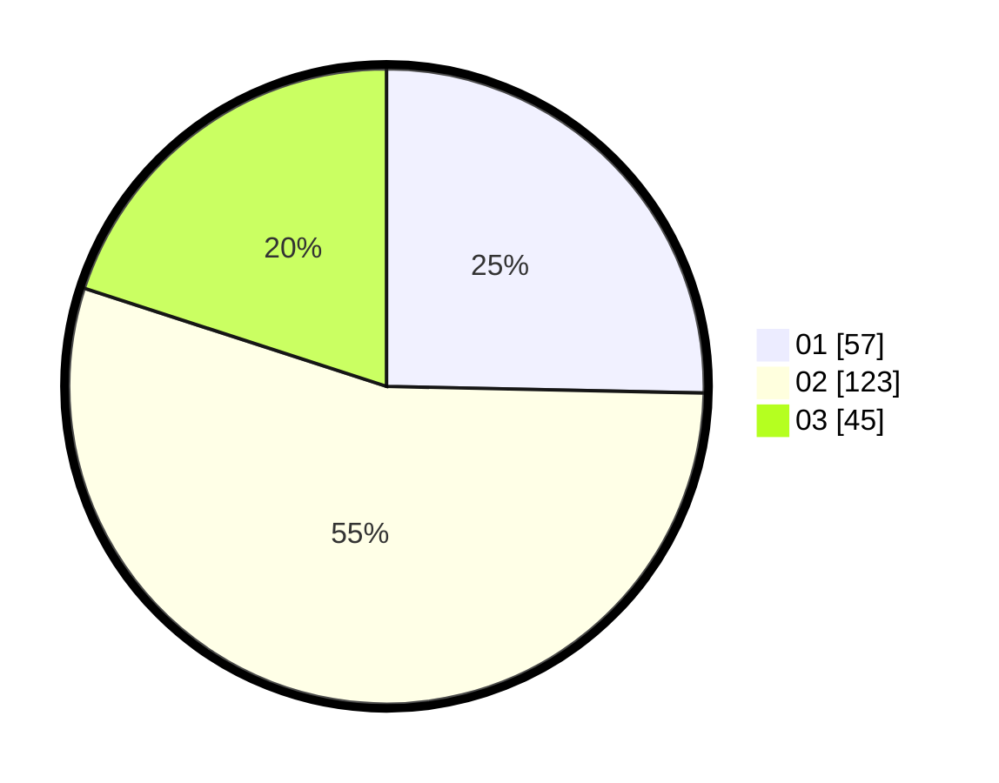

# Hasil

Hasil perolehan suara paslon dapat dilihat pada file paslon-01.txt, paslon-02.txt, dan paslon-03.txt.

Jika tidak ada, artinya data tersebut belum ada pada SIREKAP.

## Perolehan Suara

 * Paslon 01: **57**.
 * Paslon 02: **123**.
 * Paslon 03: **45**.

## Foto C Plano

https://sirekap-obj-formc.kpu.go.id/83e6/pemilu/ppwp/31/75/06/10/07/3175061007194-20240214-192925--503a61ce-c0e5-41e3-955d-ae6ab32bdd66.jpg

https://sirekap-obj-formc.kpu.go.id/83e6/pemilu/ppwp/31/75/06/10/07/3175061007194-20240214-192953--8f6a0804-e150-47d7-a032-e2d9b7415f9d.jpg

https://sirekap-obj-formc.kpu.go.id/83e6/pemilu/ppwp/31/75/06/10/07/3175061007194-20240214-192958--4d9a79ec-61f8-485b-b302-9a5c0255806e.jpg
