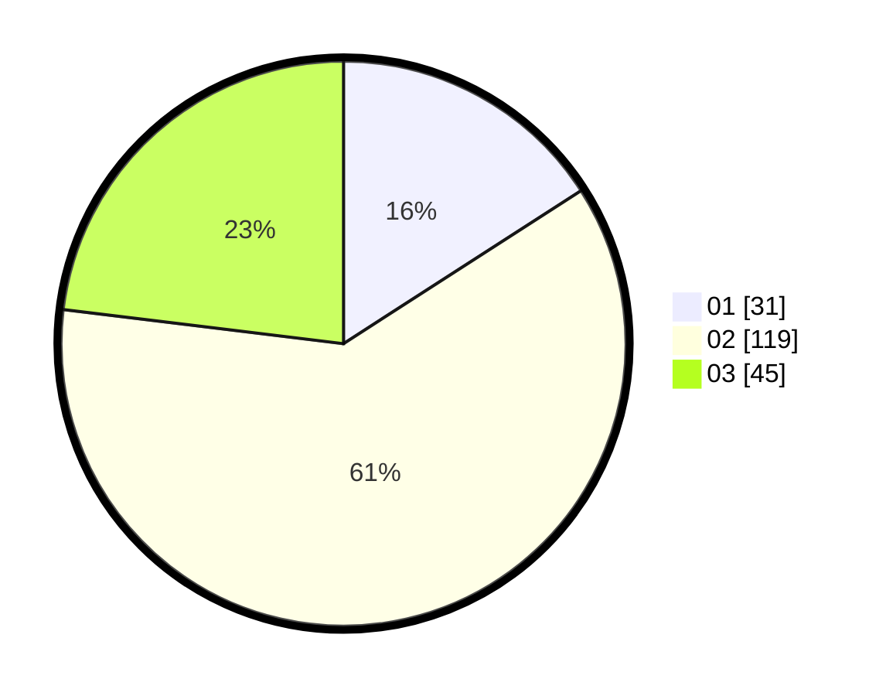

# Hasil

Hasil perolehan suara paslon dapat dilihat pada file paslon-01.txt, paslon-02.txt, dan paslon-03.txt.

Jika tidak ada, artinya data tersebut belum ada pada SIREKAP.

## Perolehan Suara

 * Paslon 01: **31**.
 * Paslon 02: **119**.
 * Paslon 03: **45**.

## Foto C Plano

https://sirekap-obj-formc.kpu.go.id/f504/pemilu/ppwp/31/75/06/10/07/3175061007195-20240214-194634--b68bd59a-0dac-42cd-99a2-075beb8620b7.jpg

https://sirekap-obj-formc.kpu.go.id/f504/pemilu/ppwp/31/75/06/10/07/3175061007195-20240214-194653--4ef7558c-11d2-4c96-9be1-4df7c3928c67.jpg

https://sirekap-obj-formc.kpu.go.id/f504/pemilu/ppwp/31/75/06/10/07/3175061007195-20240214-194713--98a78445-df7d-4eef-a1e7-8f1fd0b7f8c5.jpg

## DATA PEMILIH TETAP

Jumlah pemilih dalam DPT: **274**.
 * L: **138**.
 * P: **136**.

## DATA PENGGUNA HAK PILIH

Jumlah pengguna hak pilih dalam DPT: **198**.
 * L: **96**.
 * P: **102**.

Jumlah pengguna hak pilih dalam DPTb: **0**.
 * L: **0**.
 * P: **0**.

Jumlah pengguna hak pilih dalam DPK: **0**.
 * L: **0**.
 * P: **0**.

Jumlah pengguna hak pilih: **198**.
 * L: **96**.
 * P: **102**.

## JUMLAH SUARA SAH DAN TIDAK SAH

JUMLAH SELURUH SUARA SAH: **195**.

JUMLAH SUARA TIDAK SAH: **3**.

JUMLAH SELURUH SUARA SAH DAN SUARA TIDAK SAH: **198**.
