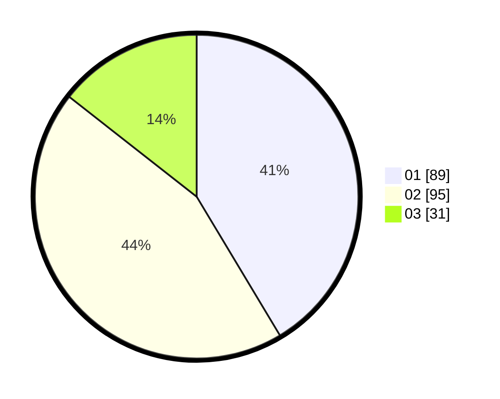

# Hasil

Hasil perolehan suara paslon dapat dilihat pada file paslon-01.txt, paslon-02.txt, dan paslon-03.txt.

Jika tidak ada, artinya data tersebut belum ada pada SIREKAP.

## Perolehan Suara

 * Paslon 01: **89**.
 * Paslon 02: **95**.
 * Paslon 03: **31**.

## Foto C Plano

https://sirekap-obj-formc.kpu.go.id/3da0/pemilu/ppwp/31/75/07/10/01/3175071001001-20240214-201736--f29517ba-0bf6-4fec-9f0a-a423e2675bfe.jpg

https://sirekap-obj-formc.kpu.go.id/3da0/pemilu/ppwp/31/75/07/10/01/3175071001001-20240214-201911--ec97ecea-8767-448a-99e2-868fe555170a.jpg

https://sirekap-obj-formc.kpu.go.id/3da0/pemilu/ppwp/31/75/07/10/01/3175071001001-20240214-202205--a1a453e2-b14f-4172-b8c6-4c66188a5c96.jpg
