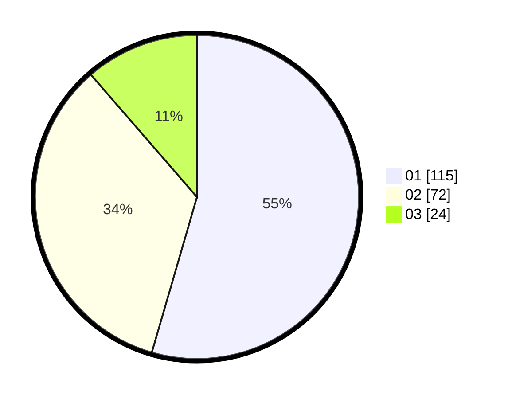

# Hasil

Hasil perolehan suara paslon dapat dilihat pada file paslon-01.txt, paslon-02.txt, dan paslon-03.txt.

Jika tidak ada, artinya data tersebut belum ada pada SIREKAP.

## Perolehan Suara

 * Paslon 01: **115**.
 * Paslon 02: **72**.
 * Paslon 03: **24**.

## Foto C Plano

https://sirekap-obj-formc.kpu.go.id/7fe7/pemilu/ppwp/31/75/07/10/01/3175071001007-20240215-001342--6ee0e274-6a4e-4489-810e-f741fd8dd7ec.jpg

https://sirekap-obj-formc.kpu.go.id/7fe7/pemilu/ppwp/31/75/07/10/01/3175071001007-20240215-001404--ddb9851a-1fef-4c55-ac8d-f5eebfcc6a9c.jpg

https://sirekap-obj-formc.kpu.go.id/7fe7/pemilu/ppwp/31/75/07/10/01/3175071001007-20240215-001610--76f0cc5f-7060-4322-85cf-105ee26c5b36.jpg
