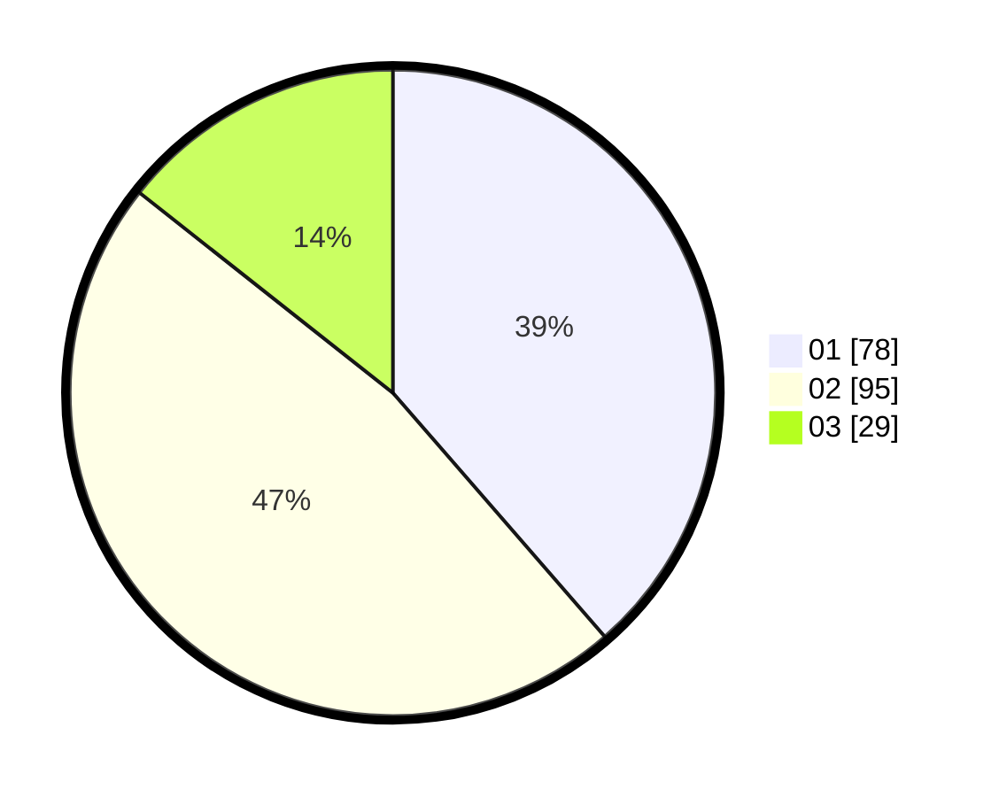

# Hasil

Hasil perolehan suara paslon dapat dilihat pada file paslon-01.txt, paslon-02.txt, dan paslon-03.txt.

Jika tidak ada, artinya data tersebut belum ada pada SIREKAP.

## Perolehan Suara

 * Paslon 01: **78**.
 * Paslon 02: **95**.
 * Paslon 03: **29**.

## Foto C Plano

https://sirekap-obj-formc.kpu.go.id/47d0/pemilu/ppwp/31/75/07/10/01/3175071001011-20240215-001101--c02e2178-e94d-4fd4-8899-47bd2b3923a1.jpg

https://sirekap-obj-formc.kpu.go.id/47d0/pemilu/ppwp/31/75/07/10/01/3175071001011-20240215-001215--05cfa9a4-8814-4d04-ba38-c1260fa4ff6f.jpg

https://sirekap-obj-formc.kpu.go.id/47d0/pemilu/ppwp/31/75/07/10/01/3175071001011-20240215-001304--2ead23d0-2383-4075-aa48-fd40c570f46a.jpg
