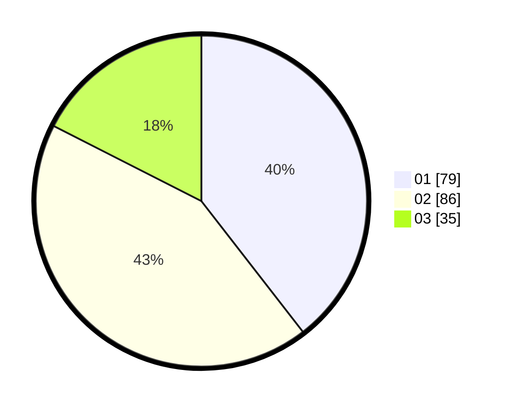

# Hasil

Hasil perolehan suara paslon dapat dilihat pada file paslon-01.txt, paslon-02.txt, dan paslon-03.txt.

Jika tidak ada, artinya data tersebut belum ada pada SIREKAP.

## Perolehan Suara

 * Paslon 01: **79**.
 * Paslon 02: **86**.
 * Paslon 03: **35**.

## Foto C Plano

https://sirekap-obj-formc.kpu.go.id/7015/pemilu/ppwp/31/75/07/10/01/3175071001013-20240214-155204--5baf5d7f-349f-4441-81d1-49ba3eed52ed.jpg

https://sirekap-obj-formc.kpu.go.id/7015/pemilu/ppwp/31/75/07/10/01/3175071001013-20240214-155350--6607079f-c8e4-4bc5-a02d-be987fd9cd44.jpg

https://sirekap-obj-formc.kpu.go.id/7015/pemilu/ppwp/31/75/07/10/01/3175071001013-20240214-155515--27c46deb-7d99-4af5-ad6d-dab8f6c9a26e.jpg

## DATA PEMILIH TETAP

Jumlah pemilih dalam DPT: **260**.
 * L: **123**.
 * P: **137**.

## DATA PENGGUNA HAK PILIH

Jumlah pengguna hak pilih dalam DPT: **202**.
 * L: **92**.
 * P: **110**.

Jumlah pengguna hak pilih dalam DPTb: **0**.
 * L: **0**.
 * P: **0**.

Jumlah pengguna hak pilih dalam DPK: **1**.
 * L: **0**.
 * P: **1**.

Jumlah pengguna hak pilih: **203**.
 * L: **92**.
 * P: **111**.

## JUMLAH SUARA SAH DAN TIDAK SAH

JUMLAH SELURUH SUARA SAH: **200**.

JUMLAH SUARA TIDAK SAH: **3**.

JUMLAH SELURUH SUARA SAH DAN SUARA TIDAK SAH: **203**.
