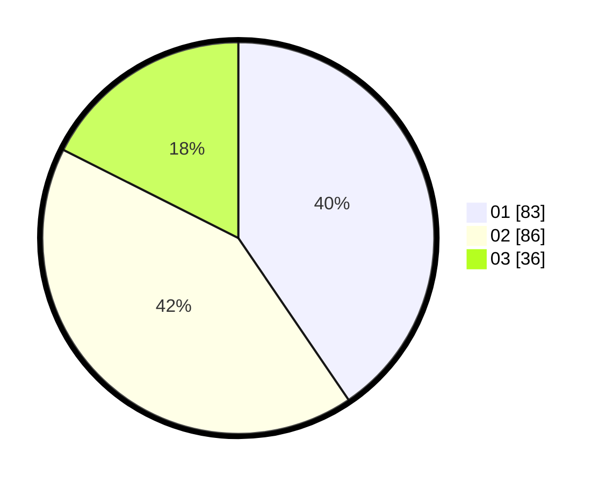

# Hasil

Hasil perolehan suara paslon dapat dilihat pada file paslon-01.txt, paslon-02.txt, dan paslon-03.txt.

Jika tidak ada, artinya data tersebut belum ada pada SIREKAP.

## Perolehan Suara

 * Paslon 01: **83**.
 * Paslon 02: **86**.
 * Paslon 03: **36**.

## Foto C Plano

https://sirekap-obj-formc.kpu.go.id/d38e/pemilu/ppwp/31/75/07/10/01/3175071001015-20240214-184835--4ddb511b-5dc1-4490-b5c6-5c2e2fb799be.jpg

https://sirekap-obj-formc.kpu.go.id/d38e/pemilu/ppwp/31/75/07/10/01/3175071001015-20240214-184512--1bc2aba8-6413-41c9-9483-c739f850e253.jpg

https://sirekap-obj-formc.kpu.go.id/d38e/pemilu/ppwp/31/75/07/10/01/3175071001015-20240214-184725--a0165a10-b034-406e-a281-ada3c4c02d2b.jpg
