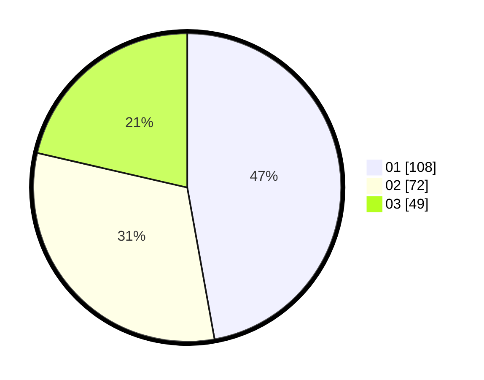

# Hasil

Hasil perolehan suara paslon dapat dilihat pada file paslon-01.txt, paslon-02.txt, dan paslon-03.txt.

Jika tidak ada, artinya data tersebut belum ada pada SIREKAP.

## Perolehan Suara

 * Paslon 01: **108**.
 * Paslon 02: **72**.
 * Paslon 03: **49**.

## Foto C Plano

https://sirekap-obj-formc.kpu.go.id/49e7/pemilu/ppwp/31/75/07/10/01/3175071001020-20240214-185624--03a3cb6e-50f3-4b3a-91e4-c37d5321342e.jpg

https://sirekap-obj-formc.kpu.go.id/49e7/pemilu/ppwp/31/75/07/10/01/3175071001020-20240214-185803--425535ea-b8d3-46d5-9bee-a3749ce60d38.jpg

https://sirekap-obj-formc.kpu.go.id/49e7/pemilu/ppwp/31/75/07/10/01/3175071001020-20240214-190228--f9594b77-0e5b-43ce-9521-54577608c91f.jpg

## DATA PEMILIH TETAP

Jumlah pemilih dalam DPT: **271**.
 * L: **132**.
 * P: **139**.

## DATA PENGGUNA HAK PILIH

Jumlah pengguna hak pilih dalam DPT: **229**.
 * L: **110**.
 * P: **119**.

Jumlah pengguna hak pilih dalam DPTb: **3**.
 * L: **1**.
 * P: **2**.

Jumlah pengguna hak pilih dalam DPK: **0**.
 * L: **0**.
 * P: **0**.

Jumlah pengguna hak pilih: **232**.
 * L: **111**.
 * P: **121**.

## JUMLAH SUARA SAH DAN TIDAK SAH

JUMLAH SELURUH SUARA SAH: **229**.

JUMLAH SUARA TIDAK SAH: **3**.

JUMLAH SELURUH SUARA SAH DAN SUARA TIDAK SAH: **232**.
