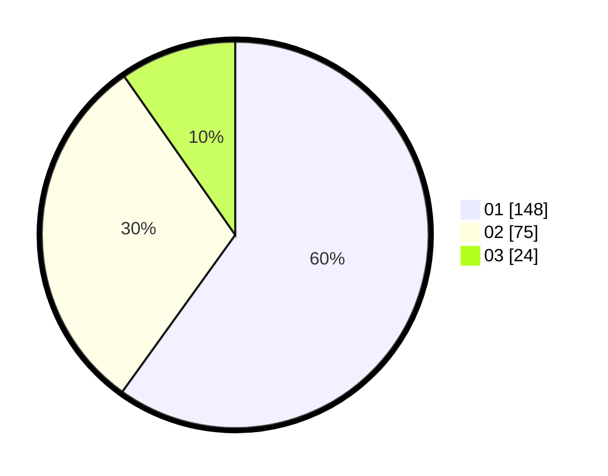

# Hasil

Hasil perolehan suara paslon dapat dilihat pada file paslon-01.txt, paslon-02.txt, dan paslon-03.txt.

Jika tidak ada, artinya data tersebut belum ada pada SIREKAP.

## Perolehan Suara

 * Paslon 01: **148**.
 * Paslon 02: **75**.
 * Paslon 03: **24**.

## Foto C Plano

https://sirekap-obj-formc.kpu.go.id/34a1/pemilu/ppwp/31/75/07/10/01/3175071001022-20240216-231357--b2f59e5b-91bb-44c8-93b5-f00bc793d2e3.jpg

https://sirekap-obj-formc.kpu.go.id/34a1/pemilu/ppwp/31/75/07/10/01/3175071001022-20240216-231408--47207a01-4d92-4617-99ca-afbd5d3279da.jpg

https://sirekap-obj-formc.kpu.go.id/34a1/pemilu/ppwp/31/75/07/10/01/3175071001022-20240216-231414--7ecdb745-2cdc-48d3-8dd7-a8f8aea4498d.jpg

## DATA PEMILIH TETAP

Jumlah pemilih dalam DPT: **267**.
 * L: **132**.
 * P: **135**.

## DATA PENGGUNA HAK PILIH

Jumlah pengguna hak pilih dalam DPT: **234**.
 * L: **113**.
 * P: **121**.

Jumlah pengguna hak pilih dalam DPTb: **9**.
 * L: **1**.
 * P: **8**.

Jumlah pengguna hak pilih dalam DPK: **5**.
 * L: **3**.
 * P: **2**.

Jumlah pengguna hak pilih: **248**.
 * L: **117**.
 * P: **131**.

## JUMLAH SUARA SAH DAN TIDAK SAH

JUMLAH SELURUH SUARA SAH: **247**.

JUMLAH SUARA TIDAK SAH: **1**.

JUMLAH SELURUH SUARA SAH DAN SUARA TIDAK SAH: **248**.
