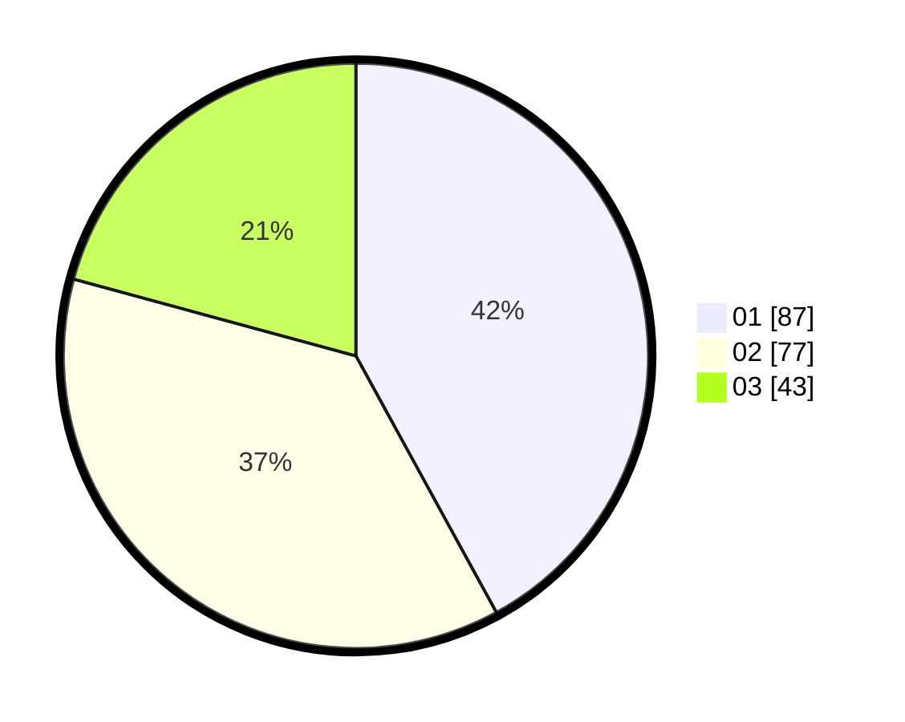

# Hasil

Hasil perolehan suara paslon dapat dilihat pada file paslon-01.txt, paslon-02.txt, dan paslon-03.txt.

Jika tidak ada, artinya data tersebut belum ada pada SIREKAP.

## Perolehan Suara

 * Paslon 01: **87**.
 * Paslon 02: **77**.
 * Paslon 03: **43**.

## Foto C Plano

https://sirekap-obj-formc.kpu.go.id/ef30/pemilu/ppwp/31/75/07/10/01/3175071001032-20240214-233046--68d28246-1700-45c5-a60a-12625053d66b.jpg

https://sirekap-obj-formc.kpu.go.id/ef30/pemilu/ppwp/31/75/07/10/01/3175071001032-20240214-233124--ddf40dfc-87e9-40ea-8a28-c2b3991bf8a6.jpg

https://sirekap-obj-formc.kpu.go.id/ef30/pemilu/ppwp/31/75/07/10/01/3175071001032-20240214-233210--b7be9c6c-2b3a-4616-88b5-99f76c0184a8.jpg
