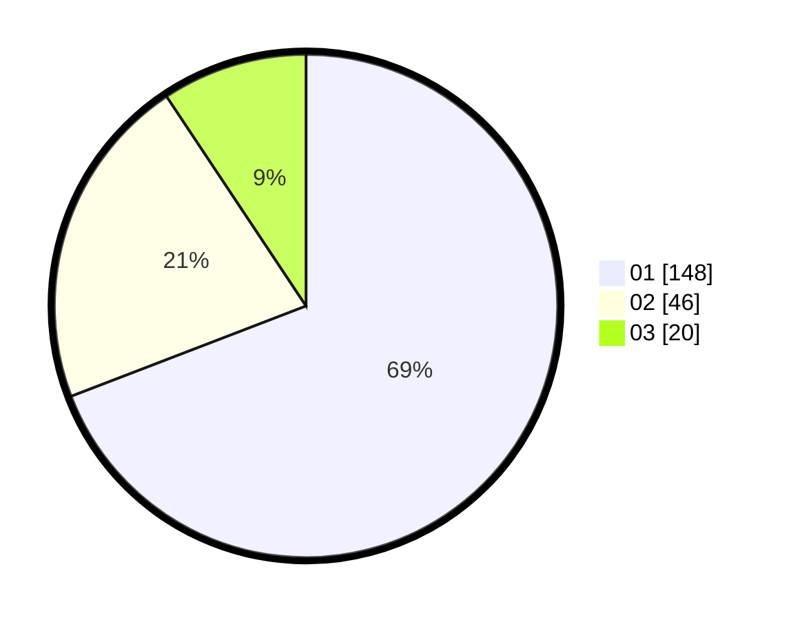

# Hasil

Hasil perolehan suara paslon dapat dilihat pada file paslon-01.txt, paslon-02.txt, dan paslon-03.txt.

Jika tidak ada, artinya data tersebut belum ada pada SIREKAP.

## Perolehan Suara

 * Paslon 01: **148**.
 * Paslon 02: **46**.
 * Paslon 03: **20**.

## Foto C Plano

https://sirekap-obj-formc.kpu.go.id/a6df/pemilu/ppwp/31/75/07/10/01/3175071001034-20240214-155839--6bee2b8c-bc83-4126-90ef-ee9eacd59f8d.jpg

https://sirekap-obj-formc.kpu.go.id/a6df/pemilu/ppwp/31/75/07/10/01/3175071001034-20240214-220704--9a86d091-53c2-4fde-921c-6f58ebcbec5b.jpg

https://sirekap-obj-formc.kpu.go.id/a6df/pemilu/ppwp/31/75/07/10/01/3175071001034-20240214-191155--83fd19c2-8018-4eee-8840-3c7c0b7e00df.jpg

## DATA PEMILIH TETAP

Jumlah pemilih dalam DPT: **264**.
 * L: **134**.
 * P: **130**.

## DATA PENGGUNA HAK PILIH

Jumlah pengguna hak pilih dalam DPT: **213**.
 * L: **105**.
 * P: **108**.

Jumlah pengguna hak pilih dalam DPTb: **2**.
 * L: **1**.
 * P: **1**.

Jumlah pengguna hak pilih dalam DPK: **1**.
 * L: **1**.
 * P: **0**.

Jumlah pengguna hak pilih: **216**.
 * L: **107**.
 * P: **109**.

## JUMLAH SUARA SAH DAN TIDAK SAH

JUMLAH SELURUH SUARA SAH: **214**.

JUMLAH SUARA TIDAK SAH: **2**.

JUMLAH SELURUH SUARA SAH DAN SUARA TIDAK SAH: **216**.
