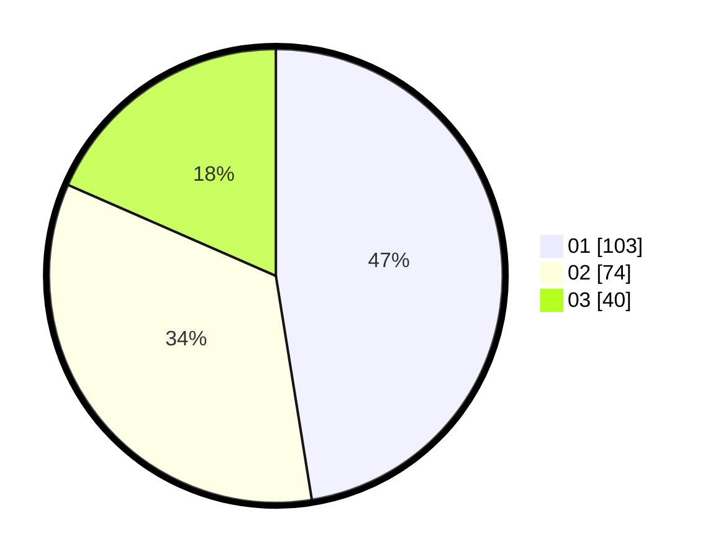

# Hasil

Hasil perolehan suara paslon dapat dilihat pada file paslon-01.txt, paslon-02.txt, dan paslon-03.txt.

Jika tidak ada, artinya data tersebut belum ada pada SIREKAP.

## Perolehan Suara

 * Paslon 01: **103**.
 * Paslon 02: **74**.
 * Paslon 03: **40**.

## Foto C Plano

https://sirekap-obj-formc.kpu.go.id/1568/pemilu/ppwp/31/75/07/10/01/3175071001036-20240214-224922--d31908ab-a7ef-485d-a86c-72d954ed937b.jpg

https://sirekap-obj-formc.kpu.go.id/1568/pemilu/ppwp/31/75/07/10/01/3175071001036-20240214-225021--61270adc-811c-4074-8ec7-93c765cc64d6.jpg

https://sirekap-obj-formc.kpu.go.id/1568/pemilu/ppwp/31/75/07/10/01/3175071001036-20240214-225121--ab007545-21a0-42c2-a081-b025ec5c57f9.jpg
