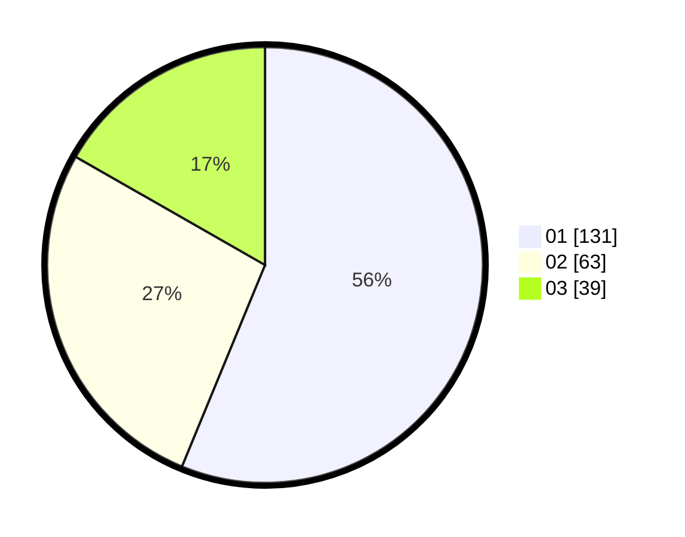

# Hasil

Hasil perolehan suara paslon dapat dilihat pada file paslon-01.txt, paslon-02.txt, dan paslon-03.txt.

Jika tidak ada, artinya data tersebut belum ada pada SIREKAP.

## Perolehan Suara

 * Paslon 01: **131**.
 * Paslon 02: **63**.
 * Paslon 03: **39**.

## Foto C Plano

https://sirekap-obj-formc.kpu.go.id/3b23/pemilu/ppwp/31/75/07/10/01/3175071001037-20240214-222433--e76c0a5c-91cb-46a7-8b16-0b31c0719e1a.jpg

https://sirekap-obj-formc.kpu.go.id/3b23/pemilu/ppwp/31/75/07/10/01/3175071001037-20240214-222017--f8a5422d-7761-428f-a89e-0c3caa24f95b.jpg

https://sirekap-obj-formc.kpu.go.id/3b23/pemilu/ppwp/31/75/07/10/01/3175071001037-20240214-222252--726df8af-ac3c-4584-87e2-90a10a1ba356.jpg
