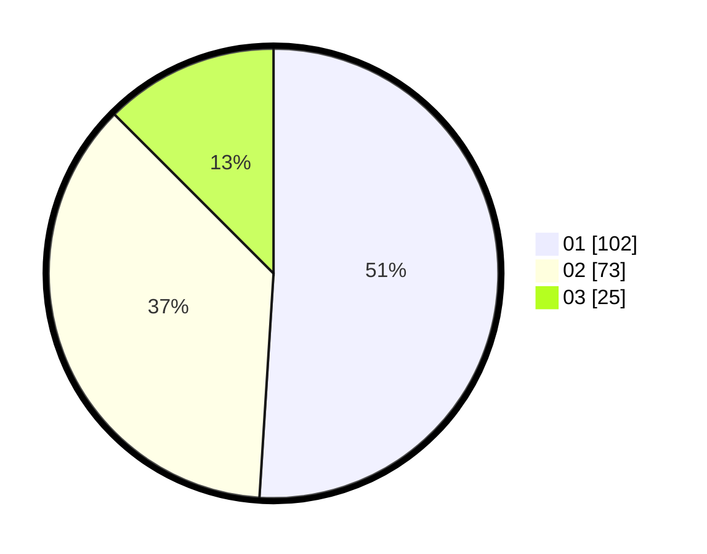

# Hasil

Hasil perolehan suara paslon dapat dilihat pada file paslon-01.txt, paslon-02.txt, dan paslon-03.txt.

Jika tidak ada, artinya data tersebut belum ada pada SIREKAP.

## Perolehan Suara

 * Paslon 01: **102**.
 * Paslon 02: **73**.
 * Paslon 03: **25**.

## Foto C Plano

https://sirekap-obj-formc.kpu.go.id/3fc9/pemilu/ppwp/31/75/07/10/01/3175071001039-20240214-235118--e2270d50-d7c6-46de-bdf8-a4199d175e74.jpg

https://sirekap-obj-formc.kpu.go.id/3fc9/pemilu/ppwp/31/75/07/10/01/3175071001039-20240214-235146--45af244d-b4dc-4503-bc2e-67c1a754207e.jpg

https://sirekap-obj-formc.kpu.go.id/3fc9/pemilu/ppwp/31/75/07/10/01/3175071001039-20240214-235207--b039ddbd-3229-4ea6-a905-a8ed50e1d876.jpg

## DATA PEMILIH TETAP

Jumlah pemilih dalam DPT: **269**.
 * L: **138**.
 * P: **131**.

## DATA PENGGUNA HAK PILIH

Jumlah pengguna hak pilih dalam DPT: **202**.
 * L: **99**.
 * P: **103**.

Jumlah pengguna hak pilih dalam DPTb: **0**.
 * L: **0**.
 * P: **0**.

Jumlah pengguna hak pilih dalam DPK: **2**.
 * L: **2**.
 * P: **0**.

Jumlah pengguna hak pilih: **204**.
 * L: **101**.
 * P: **103**.

## JUMLAH SUARA SAH DAN TIDAK SAH

JUMLAH SELURUH SUARA SAH: **200**.

JUMLAH SUARA TIDAK SAH: **4**.

JUMLAH SELURUH SUARA SAH DAN SUARA TIDAK SAH: **204**.
