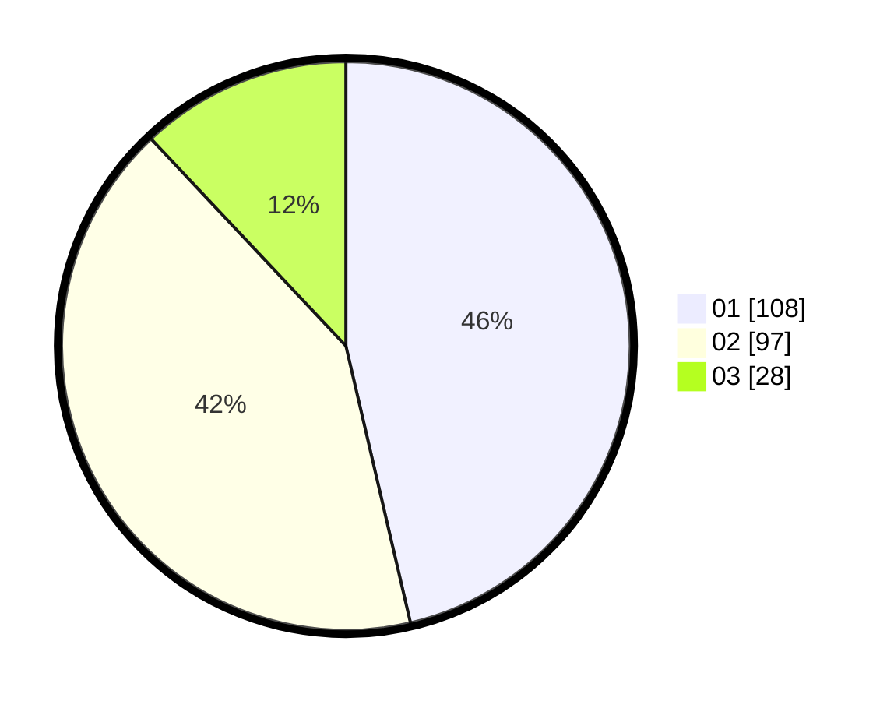

# Hasil

Hasil perolehan suara paslon dapat dilihat pada file paslon-01.txt, paslon-02.txt, dan paslon-03.txt.

Jika tidak ada, artinya data tersebut belum ada pada SIREKAP.

## Perolehan Suara

 * Paslon 01: **108**.
 * Paslon 02: **97**.
 * Paslon 03: **28**.

## Foto C Plano

https://sirekap-obj-formc.kpu.go.id/a180/pemilu/ppwp/31/75/07/10/01/3175071001046-20240214-185256--c7e58957-72dd-4b3e-a839-f99ff41db9a8.jpg

https://sirekap-obj-formc.kpu.go.id/a180/pemilu/ppwp/31/75/07/10/01/3175071001046-20240214-185306--c2364a3b-c159-487e-9912-dbae47ef7383.jpg

https://sirekap-obj-formc.kpu.go.id/a180/pemilu/ppwp/31/75/07/10/01/3175071001046-20240214-185324--07695f6a-97aa-4042-a6bc-30225d154b98.jpg

## DATA PEMILIH TETAP

Jumlah pemilih dalam DPT: **282**.
 * L: **133**.
 * P: **149**.

## DATA PENGGUNA HAK PILIH

Jumlah pengguna hak pilih dalam DPT: **233**.
 * L: **104**.
 * P: **129**.

Jumlah pengguna hak pilih dalam DPTb: **4**.
 * L: **2**.
 * P: **2**.

Jumlah pengguna hak pilih dalam DPK: **0**.
 * L: **0**.
 * P: **0**.

Jumlah pengguna hak pilih: **237**.
 * L: **106**.
 * P: **131**.

## JUMLAH SUARA SAH DAN TIDAK SAH

JUMLAH SELURUH SUARA SAH: **233**.

JUMLAH SUARA TIDAK SAH: **5**.

JUMLAH SELURUH SUARA SAH DAN SUARA TIDAK SAH: **238**.
