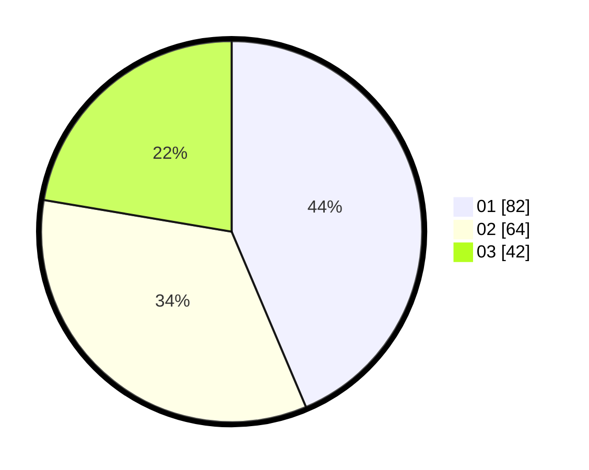

# Hasil

Hasil perolehan suara paslon dapat dilihat pada file paslon-01.txt, paslon-02.txt, dan paslon-03.txt.

Jika tidak ada, artinya data tersebut belum ada pada SIREKAP.

## Perolehan Suara

 * Paslon 01: **82**.
 * Paslon 02: **64**.
 * Paslon 03: **42**.

## Foto C Plano

https://sirekap-obj-formc.kpu.go.id/a663/pemilu/ppwp/31/75/07/10/01/3175071001057-20240215-211559--54a559c2-752e-496d-ac41-e528ab54d9eb.jpg

https://sirekap-obj-formc.kpu.go.id/a663/pemilu/ppwp/31/75/07/10/01/3175071001057-20240215-211601--1be62daf-73be-4b68-a679-bd25e17552b7.jpg

https://sirekap-obj-formc.kpu.go.id/a663/pemilu/ppwp/31/75/07/10/01/3175071001057-20240215-211559--65aa60da-2267-4ceb-a610-c0fb9d904ad2.jpg

## DATA PEMILIH TETAP

Jumlah pemilih dalam DPT: **262**.
 * L: **111**.
 * P: **151**.

## DATA PENGGUNA HAK PILIH

Jumlah pengguna hak pilih dalam DPT: **189**.
 * L: **82**.
 * P: **107**.

Jumlah pengguna hak pilih dalam DPTb: **0**.
 * L: **0**.
 * P: **0**.

Jumlah pengguna hak pilih dalam DPK: **2**.
 * L: **1**.
 * P: **1**.

Jumlah pengguna hak pilih: **191**.
 * L: **83**.
 * P: **108**.

## JUMLAH SUARA SAH DAN TIDAK SAH

JUMLAH SELURUH SUARA SAH: **188**.

JUMLAH SUARA TIDAK SAH: **3**.

JUMLAH SELURUH SUARA SAH DAN SUARA TIDAK SAH: **191**.
