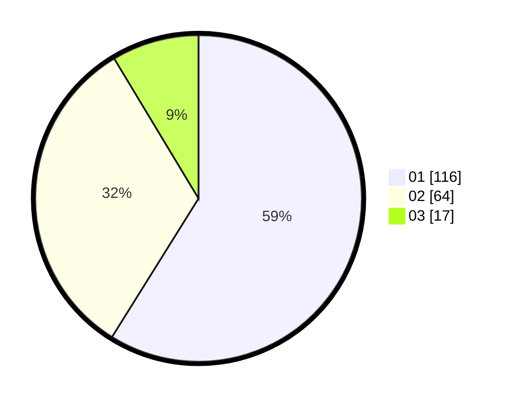

# Hasil

Hasil perolehan suara paslon dapat dilihat pada file paslon-01.txt, paslon-02.txt, dan paslon-03.txt.

Jika tidak ada, artinya data tersebut belum ada pada SIREKAP.

## Perolehan Suara

 * Paslon 01: **116**.
 * Paslon 02: **64**.
 * Paslon 03: **17**.

## Foto C Plano

https://sirekap-obj-formc.kpu.go.id/cec9/pemilu/ppwp/31/75/07/10/01/3175071001059-20240214-221547--45c8cbd3-0102-4119-90a0-5c3e4bb17401.jpg

https://sirekap-obj-formc.kpu.go.id/cec9/pemilu/ppwp/31/75/07/10/01/3175071001059-20240214-201216--ccc8bbad-34c1-4c07-974a-e4732df92eaa.jpg

https://sirekap-obj-formc.kpu.go.id/cec9/pemilu/ppwp/31/75/07/10/01/3175071001059-20240214-212053--52b9a2b4-d4d8-43ff-9f11-e009a4e8114d.jpg
