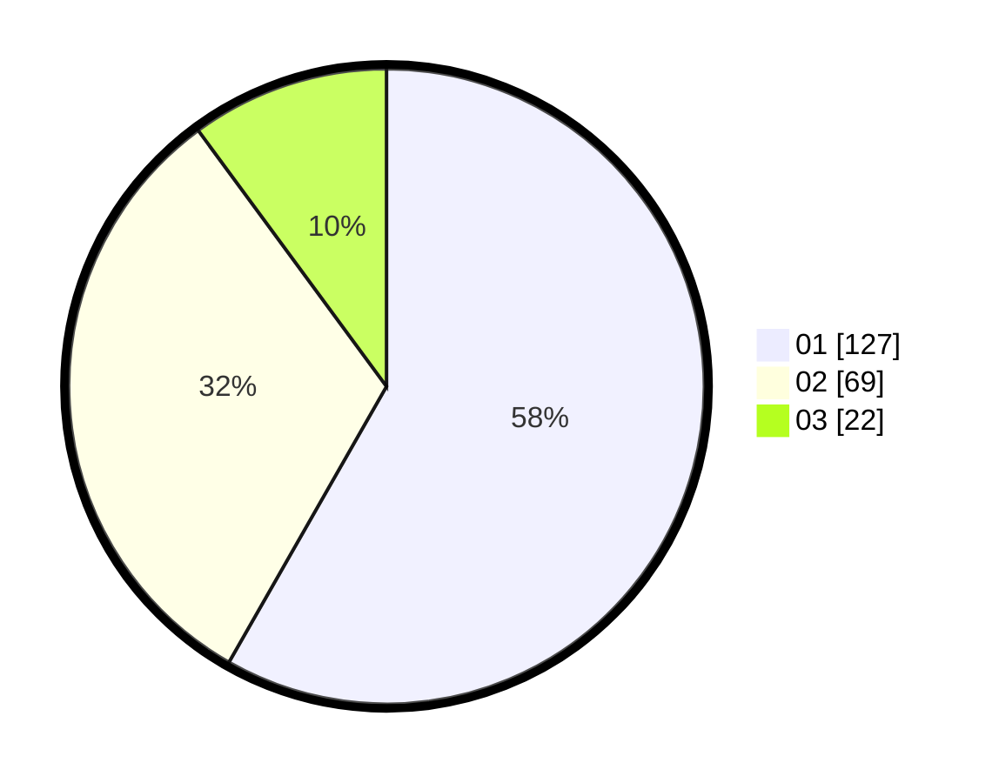

# Hasil

Hasil perolehan suara paslon dapat dilihat pada file paslon-01.txt, paslon-02.txt, dan paslon-03.txt.

Jika tidak ada, artinya data tersebut belum ada pada SIREKAP.

## Perolehan Suara

 * Paslon 01: **127**.
 * Paslon 02: **69**.
 * Paslon 03: **22**.

## Foto C Plano

https://sirekap-obj-formc.kpu.go.id/9905/pemilu/ppwp/31/75/07/10/01/3175071001073-20240214-205817--a20b6783-94e3-457e-af2f-36c99f39df61.jpg

https://sirekap-obj-formc.kpu.go.id/9905/pemilu/ppwp/31/75/07/10/01/3175071001073-20240214-220538--b4220d37-bac0-4807-9c08-77c22917e824.jpg

https://sirekap-obj-formc.kpu.go.id/9905/pemilu/ppwp/31/75/07/10/01/3175071001073-20240214-210422--3763c020-3a1a-4372-a966-3b396f9833bb.jpg

## DATA PEMILIH TETAP

Jumlah pemilih dalam DPT: **261**.
 * L: **128**.
 * P: **133**.

## DATA PENGGUNA HAK PILIH

Jumlah pengguna hak pilih dalam DPT: **221**.
 * L: **105**.
 * P: **116**.

Jumlah pengguna hak pilih dalam DPTb: **0**.
 * L: **0**.
 * P: **0**.

Jumlah pengguna hak pilih dalam DPK: **0**.
 * L: **0**.
 * P: **0**.

Jumlah pengguna hak pilih: **221**.
 * L: **0**.
 * P: **0**.

## JUMLAH SUARA SAH DAN TIDAK SAH

JUMLAH SELURUH SUARA SAH: **218**.

JUMLAH SUARA TIDAK SAH: **3**.

JUMLAH SELURUH SUARA SAH DAN SUARA TIDAK SAH: **221**.
