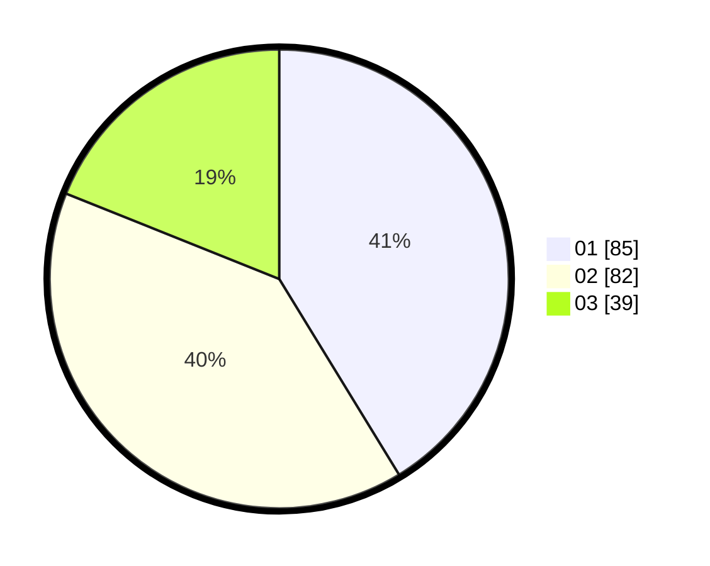

# Hasil

Hasil perolehan suara paslon dapat dilihat pada file paslon-01.txt, paslon-02.txt, dan paslon-03.txt.

Jika tidak ada, artinya data tersebut belum ada pada SIREKAP.

## Perolehan Suara

 * Paslon 01: **85**.
 * Paslon 02: **82**.
 * Paslon 03: **39**.

## Foto C Plano

https://sirekap-obj-formc.kpu.go.id/6d13/pemilu/ppwp/31/75/07/10/01/3175071001077-20240214-192106--157fa4db-d27c-4996-b435-f25621f9a8f7.jpg

https://sirekap-obj-formc.kpu.go.id/6d13/pemilu/ppwp/31/75/07/10/01/3175071001077-20240214-192246--48669f39-6316-4223-a7a0-9ea1bd34fd78.jpg

https://sirekap-obj-formc.kpu.go.id/6d13/pemilu/ppwp/31/75/07/10/01/3175071001077-20240214-193437--62ed4c37-5e65-4576-8961-4f2b87e22b12.jpg

## DATA PEMILIH TETAP

Jumlah pemilih dalam DPT: **211**.
 * L: **102**.
 * P: **109**.

## DATA PENGGUNA HAK PILIH

Jumlah pengguna hak pilih dalam DPT: **211**.
 * L: **102**.
 * P: **109**.

Jumlah pengguna hak pilih dalam DPTb: **0**.
 * L: **0**.
 * P: **0**.

Jumlah pengguna hak pilih dalam DPK: **1**.
 * L: **0**.
 * P: **1**.

Jumlah pengguna hak pilih: **212**.
 * L: **102**.
 * P: **110**.

## JUMLAH SUARA SAH DAN TIDAK SAH

JUMLAH SELURUH SUARA SAH: **206**.

JUMLAH SUARA TIDAK SAH: **6**.

JUMLAH SELURUH SUARA SAH DAN SUARA TIDAK SAH: **212**.
