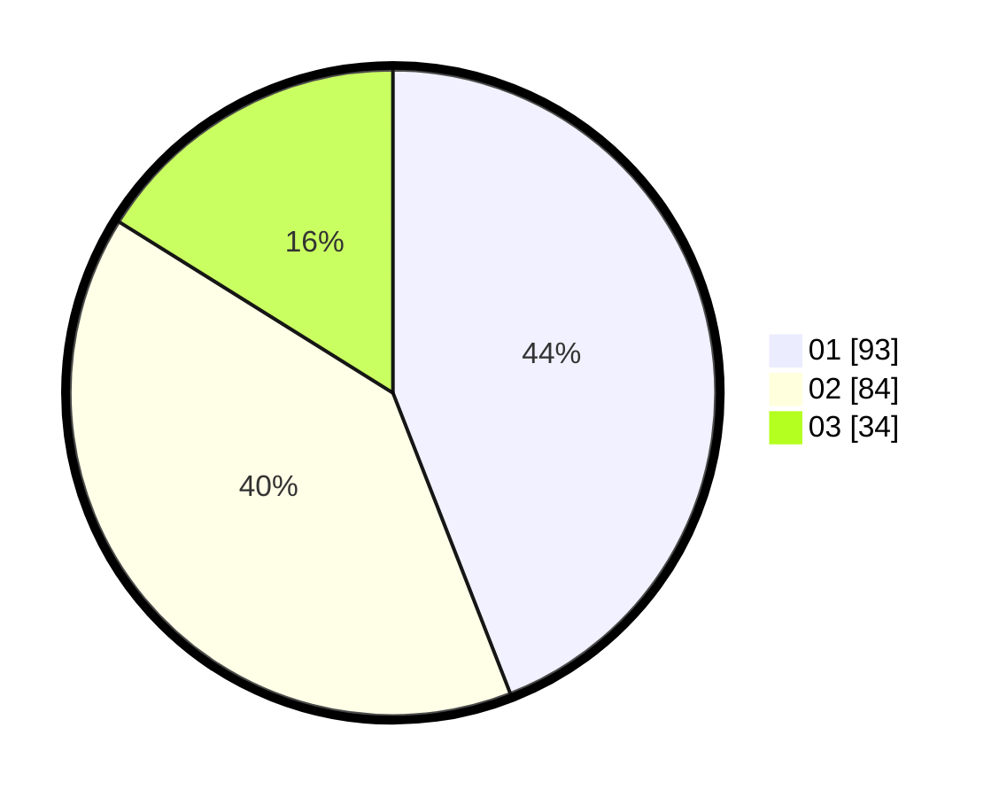

# Hasil

Hasil perolehan suara paslon dapat dilihat pada file paslon-01.txt, paslon-02.txt, dan paslon-03.txt.

Jika tidak ada, artinya data tersebut belum ada pada SIREKAP.

## Perolehan Suara

 * Paslon 01: **93**.
 * Paslon 02: **84**.
 * Paslon 03: **34**.

## Foto C Plano

https://sirekap-obj-formc.kpu.go.id/25d7/pemilu/ppwp/31/75/07/10/01/3175071001078-20240214-195847--3bd7b576-9534-4de5-8659-9bdc080f76ec.jpg

https://sirekap-obj-formc.kpu.go.id/25d7/pemilu/ppwp/31/75/07/10/01/3175071001078-20240214-202024--ae46e458-0ed2-4241-b7fd-e404edb8e796.jpg

https://sirekap-obj-formc.kpu.go.id/25d7/pemilu/ppwp/31/75/07/10/01/3175071001078-20240218-183515--d4fe408f-c087-4d1f-b416-5c4e2df32a1b.jpg

## DATA PEMILIH TETAP

Jumlah pemilih dalam DPT: **271**.
 * L: **124**.
 * P: **147**.

## DATA PENGGUNA HAK PILIH

Jumlah pengguna hak pilih dalam DPT: **211**.
 * L: **99**.
 * P: **112**.

Jumlah pengguna hak pilih dalam DPTb: **0**.
 * L: **0**.
 * P: **0**.

Jumlah pengguna hak pilih dalam DPK: **1**.
 * L: **0**.
 * P: **1**.

Jumlah pengguna hak pilih: **212**.
 * L: **99**.
 * P: **113**.

## JUMLAH SUARA SAH DAN TIDAK SAH

JUMLAH SELURUH SUARA SAH: **211**.

JUMLAH SUARA TIDAK SAH: **1**.

JUMLAH SELURUH SUARA SAH DAN SUARA TIDAK SAH: **212**.
