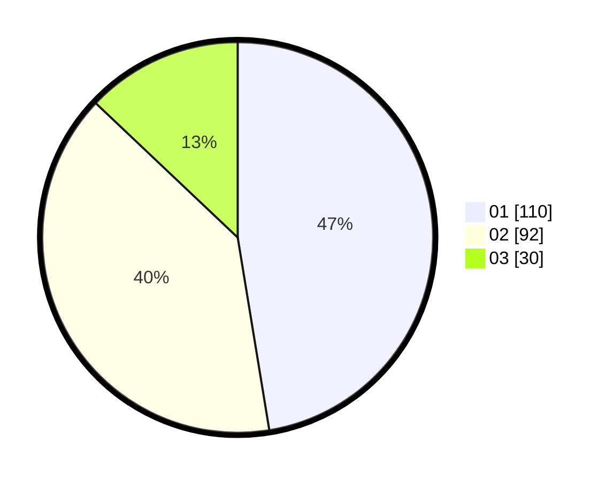

# Hasil

Hasil perolehan suara paslon dapat dilihat pada file paslon-01.txt, paslon-02.txt, dan paslon-03.txt.

Jika tidak ada, artinya data tersebut belum ada pada SIREKAP.

## Perolehan Suara

 * Paslon 01: **110**.
 * Paslon 02: **92**.
 * Paslon 03: **30**.

## Foto C Plano

https://sirekap-obj-formc.kpu.go.id/2c65/pemilu/ppwp/31/75/07/10/01/3175071001085-20240214-233822--ba168082-7ad0-4aa1-ac86-a00fa8ebd5e0.jpg

https://sirekap-obj-formc.kpu.go.id/2c65/pemilu/ppwp/31/75/07/10/01/3175071001085-20240215-021023--6d474a06-9003-4cd3-ab18-ef19bcb31896.jpg

https://sirekap-obj-formc.kpu.go.id/2c65/pemilu/ppwp/31/75/07/10/01/3175071001085-20240214-234413--8b3366d1-f808-4ae0-a5db-8fe7312d83dd.jpg
