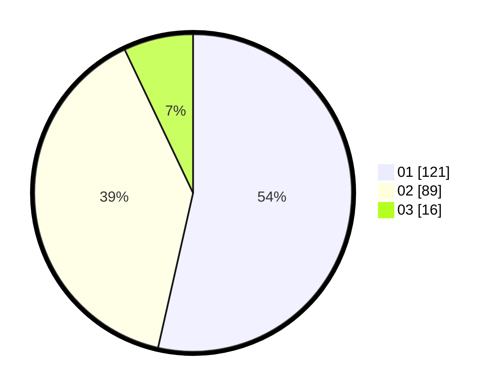

# Hasil

Hasil perolehan suara paslon dapat dilihat pada file paslon-01.txt, paslon-02.txt, dan paslon-03.txt.

Jika tidak ada, artinya data tersebut belum ada pada SIREKAP.

## Perolehan Suara

 * Paslon 01: **121**.
 * Paslon 02: **89**.
 * Paslon 03: **16**.

## Foto C Plano

https://sirekap-obj-formc.kpu.go.id/1129/pemilu/ppwp/31/75/07/10/01/3175071001089-20240214-162209--d10984f7-f8b8-48e1-83d4-18395c1b2c96.jpg

https://sirekap-obj-formc.kpu.go.id/1129/pemilu/ppwp/31/75/07/10/01/3175071001089-20240214-155639--12ecf6e8-386a-4bbe-83e8-59994ad0cf79.jpg

https://sirekap-obj-formc.kpu.go.id/1129/pemilu/ppwp/31/75/07/10/01/3175071001089-20240214-155645--d03d8ce3-31a7-4b18-a85c-f8e5a943c2f2.jpg

## DATA PEMILIH TETAP

Jumlah pemilih dalam DPT: **269**.
 * L: **133**.
 * P: **136**.

## DATA PENGGUNA HAK PILIH

Jumlah pengguna hak pilih dalam DPT: **207**.
 * L: **98**.
 * P: **109**.

Jumlah pengguna hak pilih dalam DPTb: **0**.
 * L: **0**.
 * P: **0**.

Jumlah pengguna hak pilih dalam DPK: **0**.
 * L: **0**.
 * P: **0**.

Jumlah pengguna hak pilih: **207**.
 * L: **98**.
 * P: **109**.

## JUMLAH SUARA SAH DAN TIDAK SAH

JUMLAH SELURUH SUARA SAH: **206**.

JUMLAH SUARA TIDAK SAH: **1**.

JUMLAH SELURUH SUARA SAH DAN SUARA TIDAK SAH: **207**.
