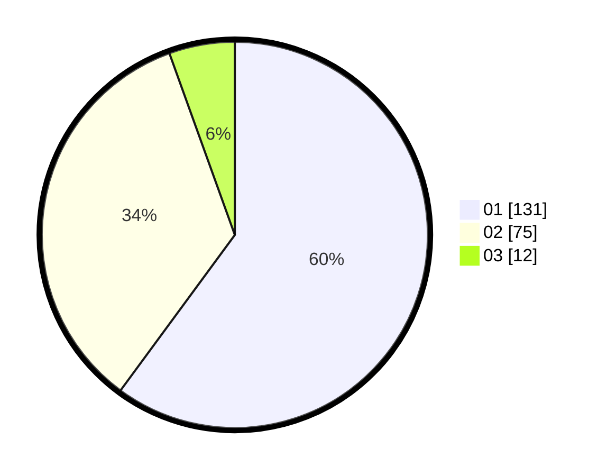

# Hasil

Hasil perolehan suara paslon dapat dilihat pada file paslon-01.txt, paslon-02.txt, dan paslon-03.txt.

Jika tidak ada, artinya data tersebut belum ada pada SIREKAP.

## Perolehan Suara

 * Paslon 01: **131**.
 * Paslon 02: **75**.
 * Paslon 03: **12**.

## Foto C Plano

https://sirekap-obj-formc.kpu.go.id/4586/pemilu/ppwp/31/75/07/10/01/3175071001090-20240214-155524--615218d6-6092-4e67-86bb-e6f9eec9b49d.jpg

https://sirekap-obj-formc.kpu.go.id/4586/pemilu/ppwp/31/75/07/10/01/3175071001090-20240214-155651--150529e4-a31a-4d0a-b829-a47aae74b51d.jpg

https://sirekap-obj-formc.kpu.go.id/4586/pemilu/ppwp/31/75/07/10/01/3175071001090-20240214-155707--d39173c7-6a7a-495a-94ce-1abcb4803ce0.jpg

## DATA PEMILIH TETAP

Jumlah pemilih dalam DPT: **264**.
 * L: **134**.
 * P: **130**.

## DATA PENGGUNA HAK PILIH

Jumlah pengguna hak pilih dalam DPT: **223**.
 * L: **108**.
 * P: **115**.

Jumlah pengguna hak pilih dalam DPTb: **0**.
 * L: **0**.
 * P: **0**.

Jumlah pengguna hak pilih dalam DPK: **0**.
 * L: **0**.
 * P: **0**.

Jumlah pengguna hak pilih: **223**.
 * L: **108**.
 * P: **115**.

## JUMLAH SUARA SAH DAN TIDAK SAH

JUMLAH SELURUH SUARA SAH: **218**.

JUMLAH SUARA TIDAK SAH: **5**.

JUMLAH SELURUH SUARA SAH DAN SUARA TIDAK SAH: **223**.
