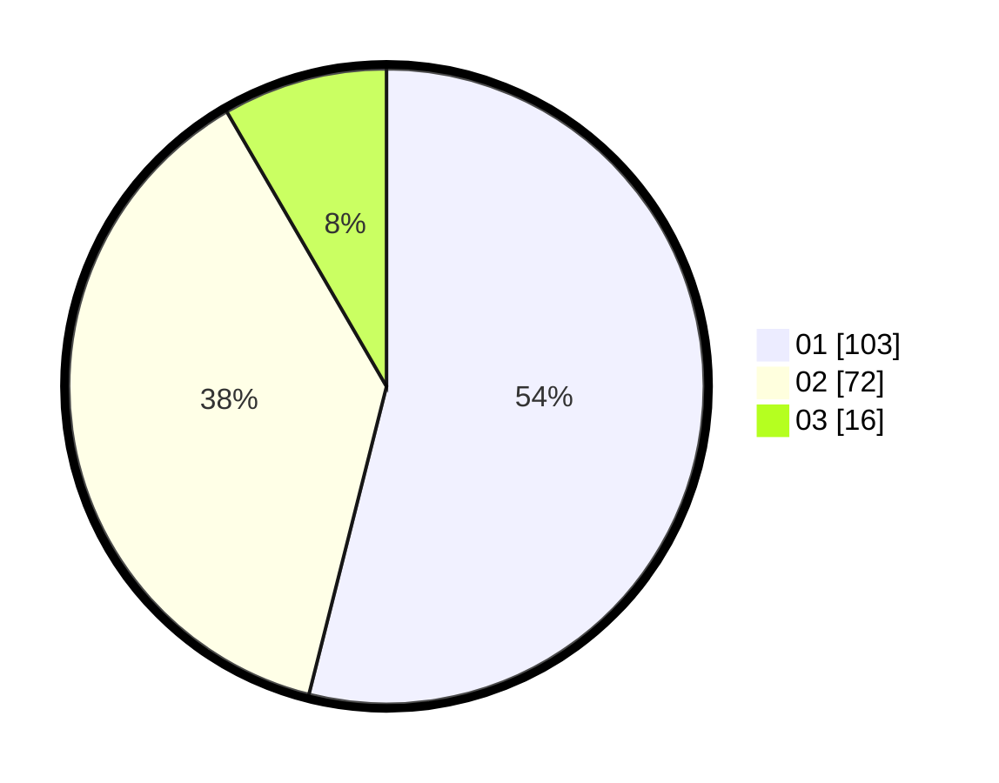

# Hasil

Hasil perolehan suara paslon dapat dilihat pada file paslon-01.txt, paslon-02.txt, dan paslon-03.txt.

Jika tidak ada, artinya data tersebut belum ada pada SIREKAP.

## Perolehan Suara

 * Paslon 01: **103**.
 * Paslon 02: **72**.
 * Paslon 03: **16**.

## Foto C Plano

https://sirekap-obj-formc.kpu.go.id/8ab6/pemilu/ppwp/31/75/07/10/01/3175071001091-20240215-230252--c6938d32-0131-4d5e-8fae-ea6285cdcb00.jpg

https://sirekap-obj-formc.kpu.go.id/8ab6/pemilu/ppwp/31/75/07/10/01/3175071001091-20240215-230255--818f401e-7d08-4fb2-b7d8-8870d308487d.jpg

https://sirekap-obj-formc.kpu.go.id/8ab6/pemilu/ppwp/31/75/07/10/01/3175071001091-20240215-230253--e83c12be-0445-4bd6-a9cd-91e1e6859646.jpg

## DATA PEMILIH TETAP

Jumlah pemilih dalam DPT: **266**.
 * L: **127**.
 * P: **139**.

## DATA PENGGUNA HAK PILIH

Jumlah pengguna hak pilih dalam DPT: **195**.
 * L: **88**.
 * P: **107**.

Jumlah pengguna hak pilih dalam DPTb: **1**.
 * L: **1**.
 * P: **0**.

Jumlah pengguna hak pilih dalam DPK: **0**.
 * L: **0**.
 * P: **0**.

Jumlah pengguna hak pilih: **196**.
 * L: **89**.
 * P: **107**.

## JUMLAH SUARA SAH DAN TIDAK SAH

JUMLAH SELURUH SUARA SAH: **191**.

JUMLAH SUARA TIDAK SAH: **5**.

JUMLAH SELURUH SUARA SAH DAN SUARA TIDAK SAH: **196**.
