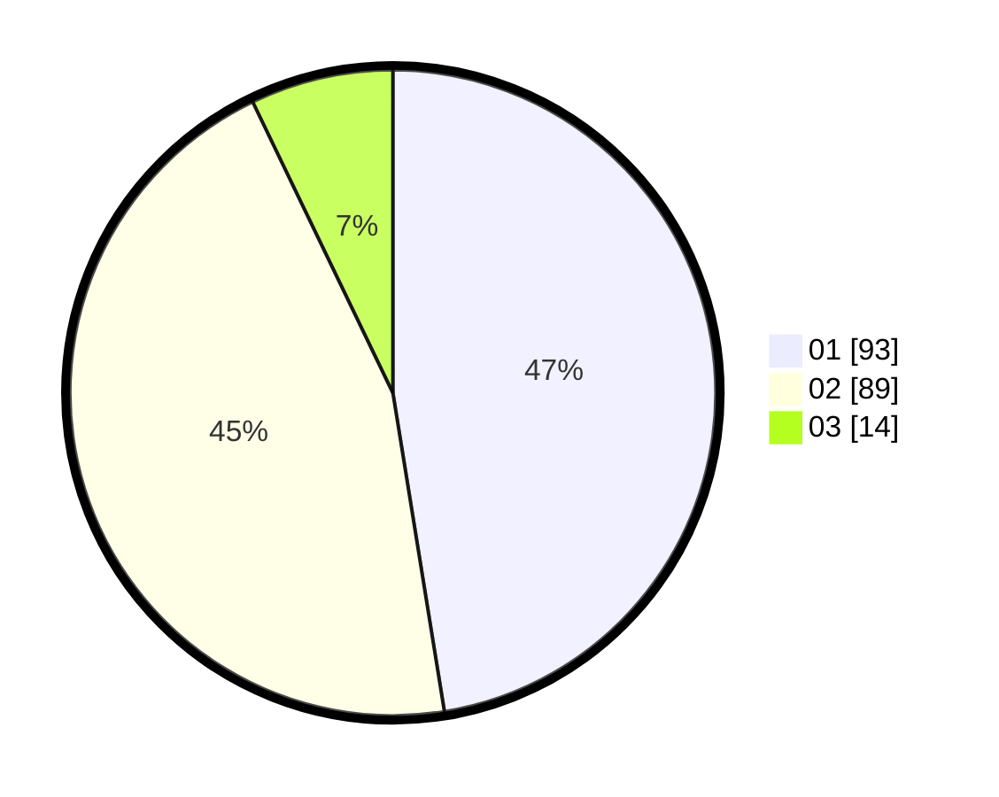

# Hasil

Hasil perolehan suara paslon dapat dilihat pada file paslon-01.txt, paslon-02.txt, dan paslon-03.txt.

Jika tidak ada, artinya data tersebut belum ada pada SIREKAP.

## Perolehan Suara

 * Paslon 01: **93**.
 * Paslon 02: **89**.
 * Paslon 03: **14**.

## Foto C Plano

https://sirekap-obj-formc.kpu.go.id/03a9/pemilu/ppwp/31/75/07/10/01/3175071001094-20240214-201659--680b74b4-a575-49fa-ac29-84ec5c0a1604.jpg

https://sirekap-obj-formc.kpu.go.id/03a9/pemilu/ppwp/31/75/07/10/01/3175071001094-20240214-201346--90389892-74b7-43f2-bca6-b45f1b73caac.jpg

https://sirekap-obj-formc.kpu.go.id/03a9/pemilu/ppwp/31/75/07/10/01/3175071001094-20240214-230245--36ad1d46-59ab-4e5a-a148-68665e304653.jpg
