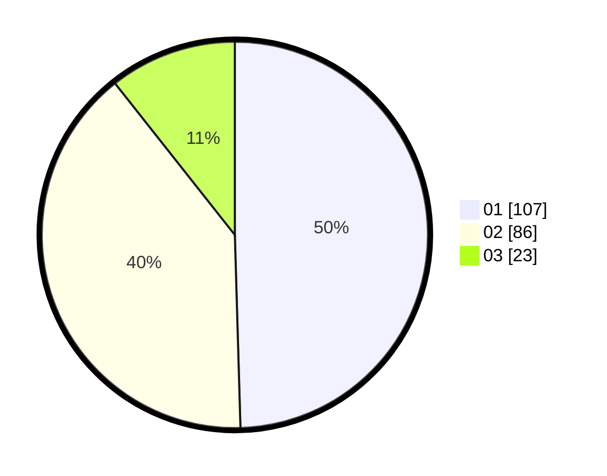

# Hasil

Hasil perolehan suara paslon dapat dilihat pada file paslon-01.txt, paslon-02.txt, dan paslon-03.txt.

Jika tidak ada, artinya data tersebut belum ada pada SIREKAP.

## Perolehan Suara

 * Paslon 01: **107**.
 * Paslon 02: **86**.
 * Paslon 03: **23**.

## Foto C Plano

https://sirekap-obj-formc.kpu.go.id/34ed/pemilu/ppwp/31/75/07/10/01/3175071001095-20240214-190734--aa93696a-30b5-42d9-ba84-b8a49d77eb8e.jpg

https://sirekap-obj-formc.kpu.go.id/34ed/pemilu/ppwp/31/75/07/10/01/3175071001095-20240214-190755--759a39c0-8560-4db7-9af3-a05352a81524.jpg

https://sirekap-obj-formc.kpu.go.id/34ed/pemilu/ppwp/31/75/07/10/01/3175071001095-20240214-190817--509831bc-8927-4ee9-a5a4-b9e31b40758d.jpg

## DATA PEMILIH TETAP

Jumlah pemilih dalam DPT: **275**.
 * L: **129**.
 * P: **146**.

## DATA PENGGUNA HAK PILIH

Jumlah pengguna hak pilih dalam DPT: **210**.
 * L: **97**.
 * P: **113**.

Jumlah pengguna hak pilih dalam DPTb: **0**.
 * L: **0**.
 * P: **0**.

Jumlah pengguna hak pilih dalam DPK: **7**.
 * L: **4**.
 * P: **3**.

Jumlah pengguna hak pilih: **217**.
 * L: **101**.
 * P: **116**.

## JUMLAH SUARA SAH DAN TIDAK SAH

JUMLAH SELURUH SUARA SAH: **216**.

JUMLAH SUARA TIDAK SAH: **1**.

JUMLAH SELURUH SUARA SAH DAN SUARA TIDAK SAH: **217**.
