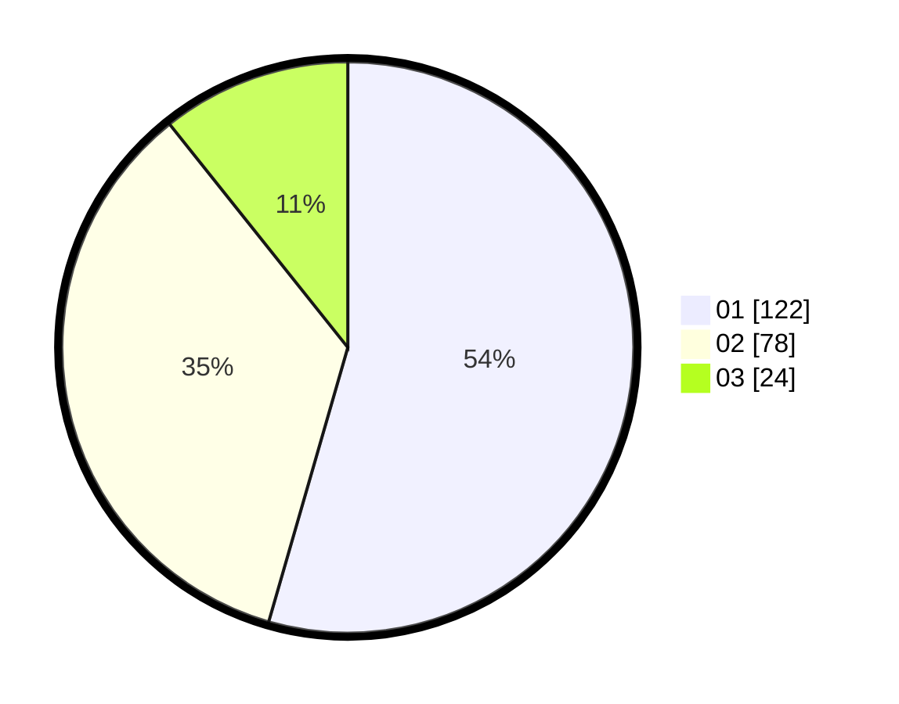

# Hasil

Hasil perolehan suara paslon dapat dilihat pada file paslon-01.txt, paslon-02.txt, dan paslon-03.txt.

Jika tidak ada, artinya data tersebut belum ada pada SIREKAP.

## Perolehan Suara

 * Paslon 01: **122**.
 * Paslon 02: **78**.
 * Paslon 03: **24**.

## Foto C Plano

https://sirekap-obj-formc.kpu.go.id/a52b/pemilu/ppwp/31/75/07/10/01/3175071001098-20240214-155337--c89536d7-95b0-447c-8245-fca66ac2b4b6.jpg

https://sirekap-obj-formc.kpu.go.id/a52b/pemilu/ppwp/31/75/07/10/01/3175071001098-20240214-155520--5728f611-ebce-4af1-a007-cf33de95ad20.jpg

https://sirekap-obj-formc.kpu.go.id/a52b/pemilu/ppwp/31/75/07/10/01/3175071001098-20240214-155556--b0158dc5-5f27-4ea1-b837-4c1485e6ffdd.jpg

## DATA PEMILIH TETAP

Jumlah pemilih dalam DPT: **264**.
 * L: **138**.
 * P: **126**.

## DATA PENGGUNA HAK PILIH

Jumlah pengguna hak pilih dalam DPT: **207**.
 * L: **99**.
 * P: **108**.

Jumlah pengguna hak pilih dalam DPTb: **0**.
 * L: **0**.
 * P: **0**.

Jumlah pengguna hak pilih dalam DPK: **4**.
 * L: **1**.
 * P: **3**.

Jumlah pengguna hak pilih: **211**.
 * L: **100**.
 * P: **111**.

## JUMLAH SUARA SAH DAN TIDAK SAH

JUMLAH SELURUH SUARA SAH: **211**.

JUMLAH SUARA TIDAK SAH: **0**.

JUMLAH SELURUH SUARA SAH DAN SUARA TIDAK SAH: **211**.
