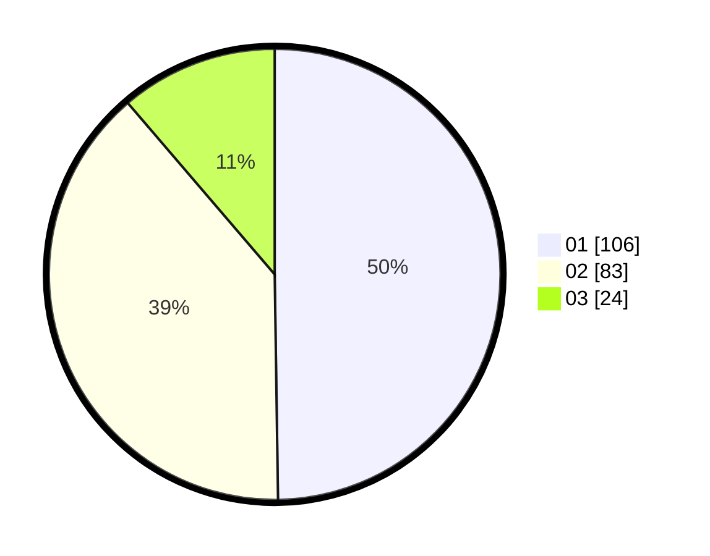

# Hasil

Hasil perolehan suara paslon dapat dilihat pada file paslon-01.txt, paslon-02.txt, dan paslon-03.txt.

Jika tidak ada, artinya data tersebut belum ada pada SIREKAP.

## Perolehan Suara

 * Paslon 01: **106**.
 * Paslon 02: **83**.
 * Paslon 03: **24**.

## Foto C Plano

https://sirekap-obj-formc.kpu.go.id/1a18/pemilu/ppwp/31/75/07/10/01/3175071001100-20240214-194449--b62b3db4-18b5-422c-addf-4283fc1697e3.jpg

https://sirekap-obj-formc.kpu.go.id/1a18/pemilu/ppwp/31/75/07/10/01/3175071001100-20240214-211156--b371a192-2571-4e7a-8b43-fe73b974e1ff.jpg

https://sirekap-obj-formc.kpu.go.id/1a18/pemilu/ppwp/31/75/07/10/01/3175071001100-20240214-194749--7944f2d3-b552-4cdf-ba12-890c006a980b.jpg

## DATA PEMILIH TETAP

Jumlah pemilih dalam DPT: **270**.
 * L: **152**.
 * P: **118**.

## DATA PENGGUNA HAK PILIH

Jumlah pengguna hak pilih dalam DPT: **208**.
 * L: **104**.
 * P: **104**.

Jumlah pengguna hak pilih dalam DPTb: **0**.
 * L: **0**.
 * P: **0**.

Jumlah pengguna hak pilih dalam DPK: **6**.
 * L: **3**.
 * P: **3**.

Jumlah pengguna hak pilih: **214**.
 * L: **107**.
 * P: **107**.

## JUMLAH SUARA SAH DAN TIDAK SAH

JUMLAH SELURUH SUARA SAH: **213**.

JUMLAH SUARA TIDAK SAH: **1**.

JUMLAH SELURUH SUARA SAH DAN SUARA TIDAK SAH: **214**.
