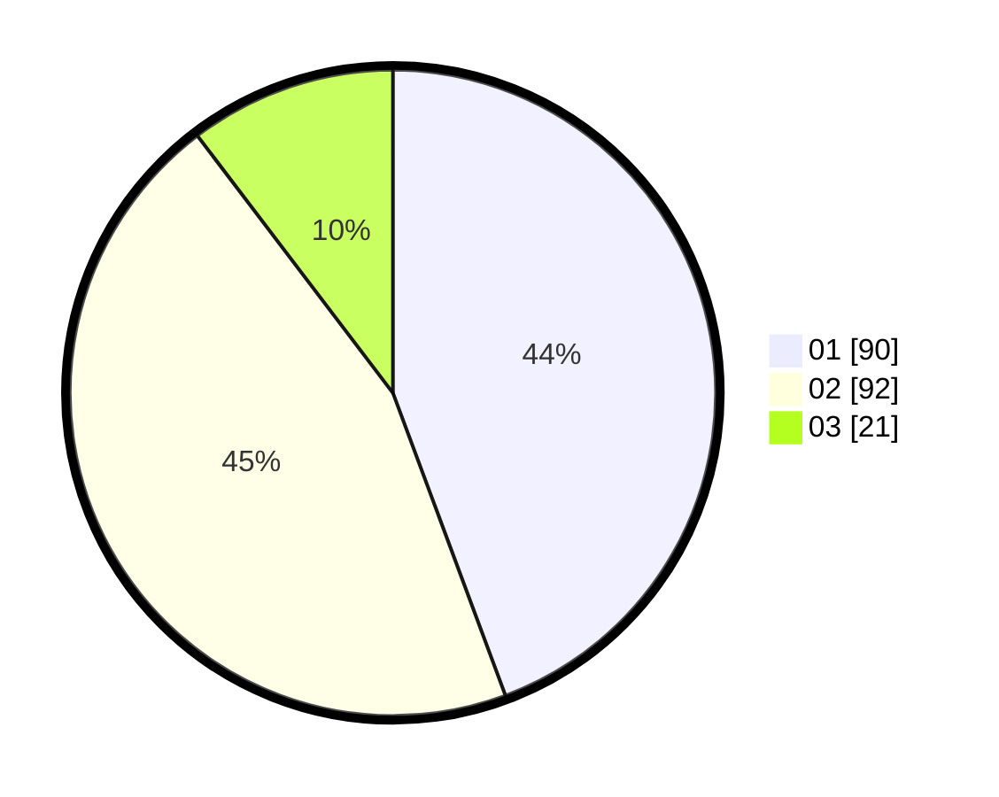

# Hasil

Hasil perolehan suara paslon dapat dilihat pada file paslon-01.txt, paslon-02.txt, dan paslon-03.txt.

Jika tidak ada, artinya data tersebut belum ada pada SIREKAP.

## Perolehan Suara

 * Paslon 01: **90**.
 * Paslon 02: **92**.
 * Paslon 03: **21**.

## Foto C Plano

https://sirekap-obj-formc.kpu.go.id/1329/pemilu/ppwp/31/75/07/10/01/3175071001102-20240214-231251--901844a7-22b0-4ad3-a54c-afe1623ed940.jpg

https://sirekap-obj-formc.kpu.go.id/1329/pemilu/ppwp/31/75/07/10/01/3175071001102-20240214-231309--dee88060-0fd9-47ae-af2c-3f84127746d8.jpg

https://sirekap-obj-formc.kpu.go.id/1329/pemilu/ppwp/31/75/07/10/01/3175071001102-20240214-231338--8bac6083-7c35-463e-9d16-7e6dae35072a.jpg
