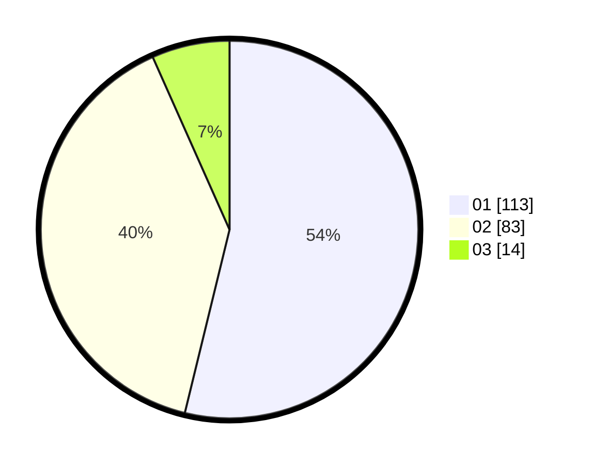

# Hasil

Hasil perolehan suara paslon dapat dilihat pada file paslon-01.txt, paslon-02.txt, dan paslon-03.txt.

Jika tidak ada, artinya data tersebut belum ada pada SIREKAP.

## Perolehan Suara

 * Paslon 01: **113**.
 * Paslon 02: **83**.
 * Paslon 03: **14**.

## Foto C Plano

https://sirekap-obj-formc.kpu.go.id/5632/pemilu/ppwp/31/75/07/10/01/3175071001106-20240215-192720--b9ea8390-9327-4a7a-91bf-6e3e5aac112f.jpg

https://sirekap-obj-formc.kpu.go.id/5632/pemilu/ppwp/31/75/07/10/01/3175071001106-20240215-192740--4c216dae-4cb3-4c8b-8aa5-601d7d8cf547.jpg

https://sirekap-obj-formc.kpu.go.id/5632/pemilu/ppwp/31/75/07/10/01/3175071001106-20240216-113046--3da24587-985f-486b-802b-d3d0c5201dd4.jpg

## DATA PEMILIH TETAP

Jumlah pemilih dalam DPT: **264**.
 * L: **128**.
 * P: **136**.

## DATA PENGGUNA HAK PILIH

Jumlah pengguna hak pilih dalam DPT: **208**.
 * L: **98**.
 * P: **110**.

Jumlah pengguna hak pilih dalam DPTb: **1**.
 * L: **0**.
 * P: **1**.

Jumlah pengguna hak pilih dalam DPK: **1**.
 * L: **0**.
 * P: **1**.

Jumlah pengguna hak pilih: **210**.
 * L: **98**.
 * P: **112**.

## JUMLAH SUARA SAH DAN TIDAK SAH

JUMLAH SELURUH SUARA SAH: **210**.

JUMLAH SUARA TIDAK SAH: **0**.

JUMLAH SELURUH SUARA SAH DAN SUARA TIDAK SAH: **210**.
