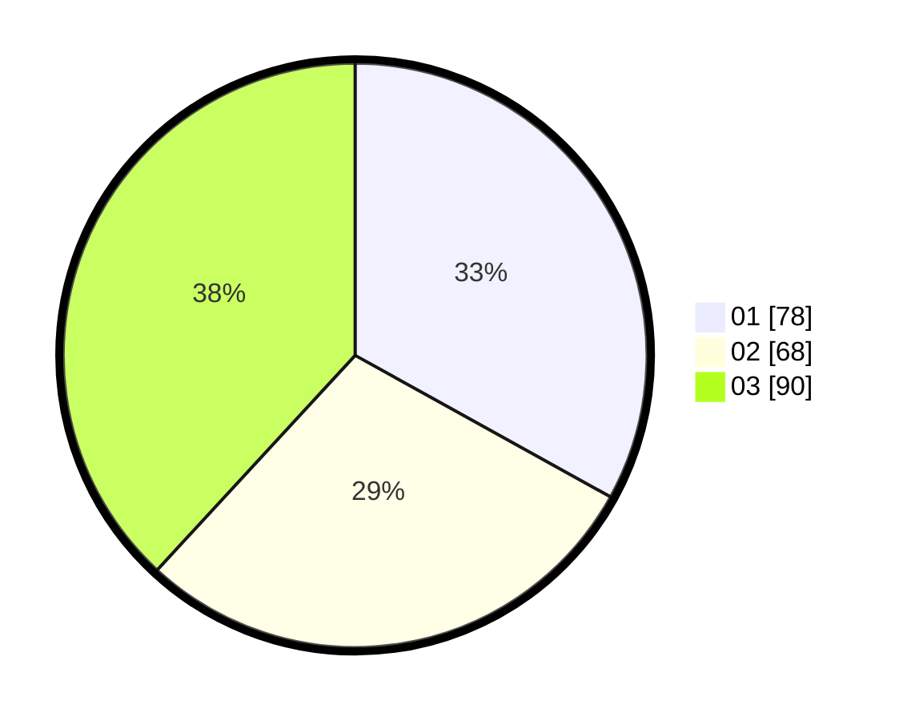

# Hasil

Hasil perolehan suara paslon dapat dilihat pada file paslon-01.txt, paslon-02.txt, dan paslon-03.txt.

Jika tidak ada, artinya data tersebut belum ada pada SIREKAP.

## Perolehan Suara

 * Paslon 01: **78**.
 * Paslon 02: **68**.
 * Paslon 03: **90**.

## Foto C Plano

https://sirekap-obj-formc.kpu.go.id/4988/pemilu/ppwp/31/75/07/10/01/3175071001107-20240214-204923--ba0da09c-444e-4444-9042-4a92df11eda4.jpg

https://sirekap-obj-formc.kpu.go.id/4988/pemilu/ppwp/31/75/07/10/01/3175071001107-20240214-204950--ea1b36fc-832e-4621-b5c8-17171b397a43.jpg

https://sirekap-obj-formc.kpu.go.id/4988/pemilu/ppwp/31/75/07/10/01/3175071001107-20240214-205017--b25d4068-f41f-4e1b-ba67-46f43e5f4e5c.jpg
