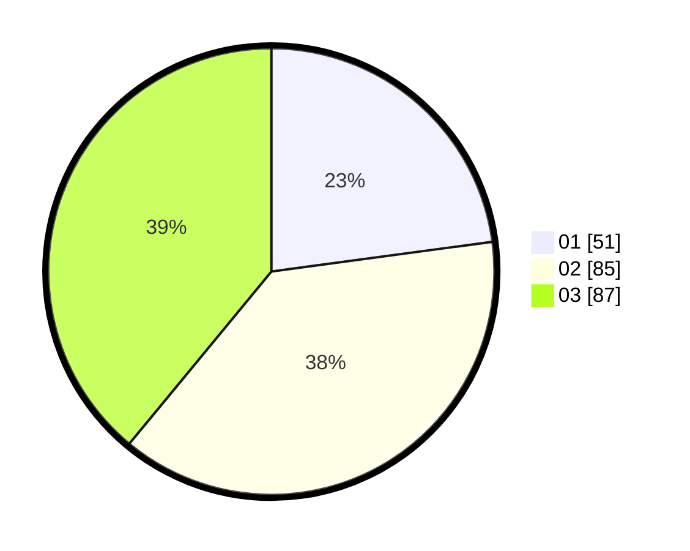

# Hasil

Hasil perolehan suara paslon dapat dilihat pada file paslon-01.txt, paslon-02.txt, dan paslon-03.txt.

Jika tidak ada, artinya data tersebut belum ada pada SIREKAP.

## Perolehan Suara

 * Paslon 01: **51**.
 * Paslon 02: **85**.
 * Paslon 03: **87**.

## Foto C Plano

https://sirekap-obj-formc.kpu.go.id/af05/pemilu/ppwp/31/75/07/10/01/3175071001108-20240214-160102--98775a5d-14ea-44b9-a302-da5ed40b35f7.jpg

https://sirekap-obj-formc.kpu.go.id/af05/pemilu/ppwp/31/75/07/10/01/3175071001108-20240214-160127--1f6e7b1c-1846-422a-bee0-802f206e5394.jpg

https://sirekap-obj-formc.kpu.go.id/af05/pemilu/ppwp/31/75/07/10/01/3175071001108-20240214-160107--ab15ecb4-c33c-4cbc-b4a9-2aa1e3ad1582.jpg

## DATA PEMILIH TETAP

Jumlah pemilih dalam DPT: **272**.
 * L: **131**.
 * P: **141**.

## DATA PENGGUNA HAK PILIH

Jumlah pengguna hak pilih dalam DPT: **221**.
 * L: **103**.
 * P: **118**.

Jumlah pengguna hak pilih dalam DPTb: **2**.
 * L: **1**.
 * P: **1**.

Jumlah pengguna hak pilih dalam DPK: **0**.
 * L: **0**.
 * P: **0**.

Jumlah pengguna hak pilih: **223**.
 * L: **104**.
 * P: **119**.

## JUMLAH SUARA SAH DAN TIDAK SAH

JUMLAH SELURUH SUARA SAH: **223**.

JUMLAH SUARA TIDAK SAH: **0**.

JUMLAH SELURUH SUARA SAH DAN SUARA TIDAK SAH: **223**.
