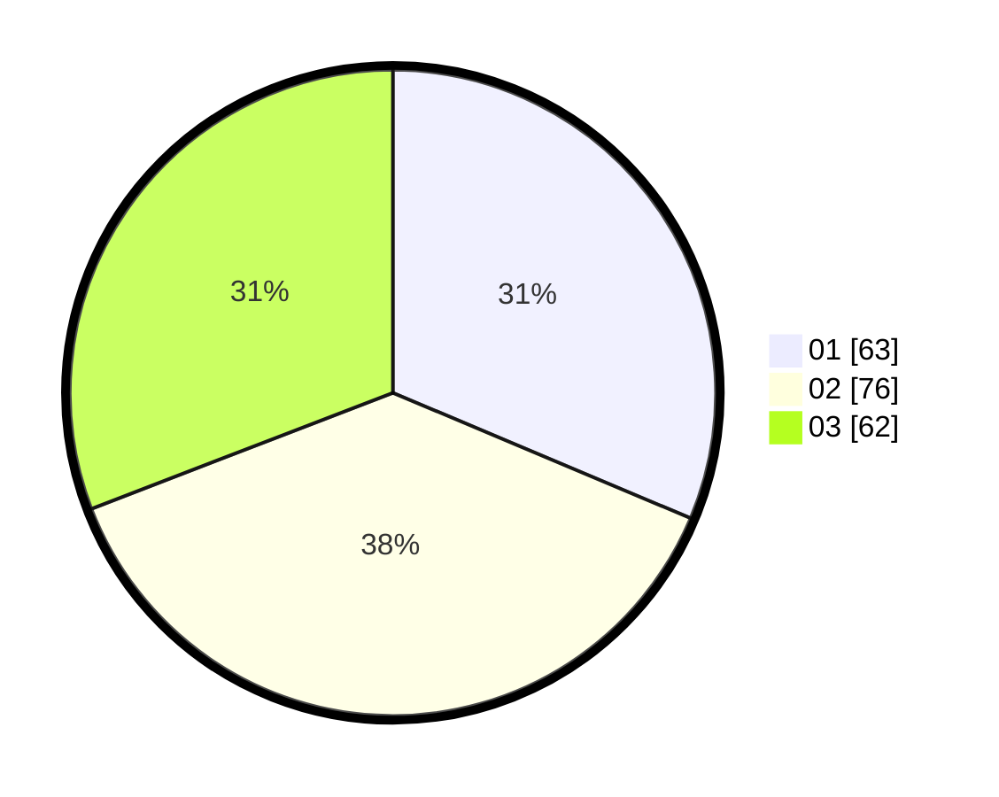

# Hasil

Hasil perolehan suara paslon dapat dilihat pada file paslon-01.txt, paslon-02.txt, dan paslon-03.txt.

Jika tidak ada, artinya data tersebut belum ada pada SIREKAP.

## Perolehan Suara

 * Paslon 01: **63**.
 * Paslon 02: **76**.
 * Paslon 03: **62**.

## Foto C Plano

https://sirekap-obj-formc.kpu.go.id/7b65/pemilu/ppwp/31/75/07/10/01/3175071001113-20240214-190109--febe4629-15af-490b-be35-697a1e4794d5.jpg

https://sirekap-obj-formc.kpu.go.id/7b65/pemilu/ppwp/31/75/07/10/01/3175071001113-20240214-190222--9bcb1c88-5695-403d-9df9-4d438d32a1e7.jpg

https://sirekap-obj-formc.kpu.go.id/7b65/pemilu/ppwp/31/75/07/10/01/3175071001113-20240214-190305--75d77e6e-a7c3-4156-a8ff-0220725710af.jpg

## DATA PEMILIH TETAP

Jumlah pemilih dalam DPT: **272**.
 * L: **134**.
 * P: **138**.

## DATA PENGGUNA HAK PILIH

Jumlah pengguna hak pilih dalam DPT: **199**.
 * L: **93**.
 * P: **106**.

Jumlah pengguna hak pilih dalam DPTb: **3**.
 * L: **1**.
 * P: **2**.

Jumlah pengguna hak pilih dalam DPK: **1**.
 * L: **0**.
 * P: **1**.

Jumlah pengguna hak pilih: **203**.
 * L: **94**.
 * P: **109**.

## JUMLAH SUARA SAH DAN TIDAK SAH

JUMLAH SELURUH SUARA SAH: **201**.

JUMLAH SUARA TIDAK SAH: **2**.

JUMLAH SELURUH SUARA SAH DAN SUARA TIDAK SAH: **203**.
