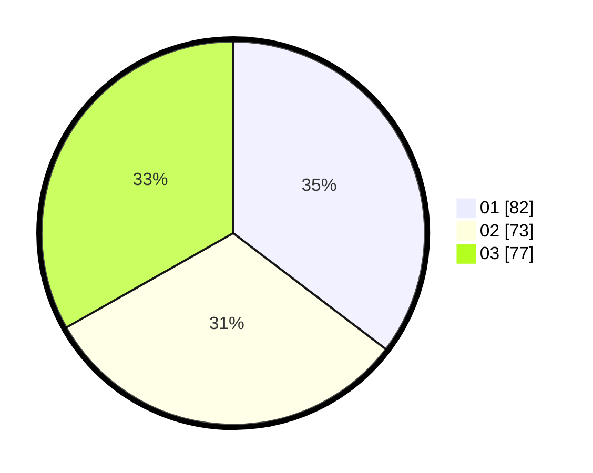

# Hasil

Hasil perolehan suara paslon dapat dilihat pada file paslon-01.txt, paslon-02.txt, dan paslon-03.txt.

Jika tidak ada, artinya data tersebut belum ada pada SIREKAP.

## Perolehan Suara

 * Paslon 01: **82**.
 * Paslon 02: **73**.
 * Paslon 03: **77**.

## Foto C Plano

https://sirekap-obj-formc.kpu.go.id/5da3/pemilu/ppwp/31/75/07/10/01/3175071001114-20240214-155309--874bd0ad-08d2-4142-a512-19de8239321a.jpg

https://sirekap-obj-formc.kpu.go.id/5da3/pemilu/ppwp/31/75/07/10/01/3175071001114-20240214-155628--34441b41-3b78-45ed-bd36-15d52ea6e764.jpg

https://sirekap-obj-formc.kpu.go.id/5da3/pemilu/ppwp/31/75/07/10/01/3175071001114-20240214-185059--8183c056-2dd6-4e3b-920d-cd1352d3f9bc.jpg

## DATA PEMILIH TETAP

Jumlah pemilih dalam DPT: **274**.
 * L: **126**.
 * P: **148**.

## DATA PENGGUNA HAK PILIH

Jumlah pengguna hak pilih dalam DPT: **236**.
 * L: **109**.
 * P: **127**.

Jumlah pengguna hak pilih dalam DPTb: **2**.
 * L: **0**.
 * P: **2**.

Jumlah pengguna hak pilih dalam DPK: **1**.
 * L: **0**.
 * P: **1**.

Jumlah pengguna hak pilih: **239**.
 * L: **109**.
 * P: **130**.

## JUMLAH SUARA SAH DAN TIDAK SAH

JUMLAH SELURUH SUARA SAH: **232**.

JUMLAH SUARA TIDAK SAH: **7**.

JUMLAH SELURUH SUARA SAH DAN SUARA TIDAK SAH: **239**.
