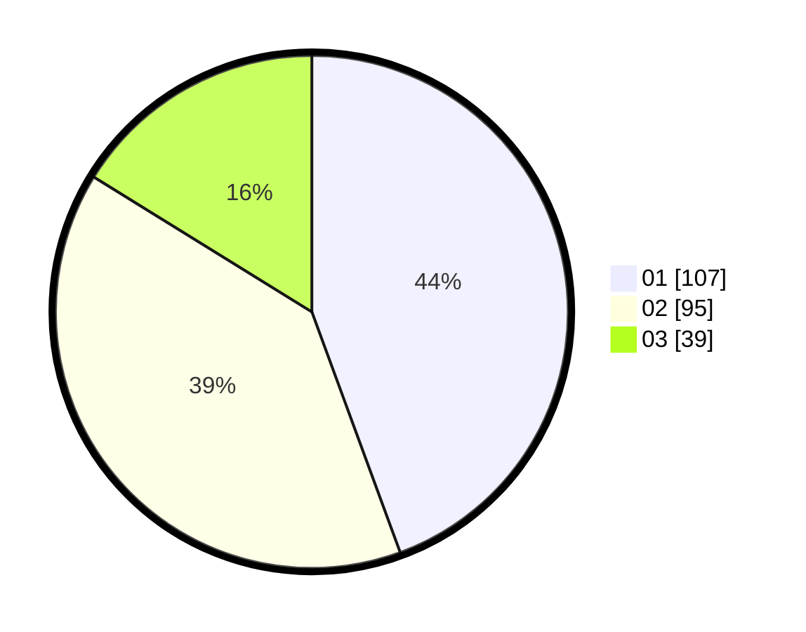

# Hasil

Hasil perolehan suara paslon dapat dilihat pada file paslon-01.txt, paslon-02.txt, dan paslon-03.txt.

Jika tidak ada, artinya data tersebut belum ada pada SIREKAP.

## Perolehan Suara

 * Paslon 01: **107**.
 * Paslon 02: **95**.
 * Paslon 03: **39**.

## Foto C Plano

https://sirekap-obj-formc.kpu.go.id/8417/pemilu/ppwp/31/75/07/10/01/3175071001117-20240216-020140--79d81070-36d0-4d79-a610-495989b16aa3.jpg

https://sirekap-obj-formc.kpu.go.id/8417/pemilu/ppwp/31/75/07/10/01/3175071001117-20240214-191354--df889051-a73a-43ad-8141-5e8660bed6be.jpg

https://sirekap-obj-formc.kpu.go.id/8417/pemilu/ppwp/31/75/07/10/01/3175071001117-20240214-191408--16fff623-c788-4979-afcc-8f898a7a4d6a.jpg

## DATA PEMILIH TETAP

Jumlah pemilih dalam DPT: **288**.
 * L: **138**.
 * P: **150**.

## DATA PENGGUNA HAK PILIH

Jumlah pengguna hak pilih dalam DPT: **236**.
 * L: **116**.
 * P: **120**.

Jumlah pengguna hak pilih dalam DPTb: **2**.
 * L: **1**.
 * P: **1**.

Jumlah pengguna hak pilih dalam DPK: **4**.
 * L: **1**.
 * P: **3**.

Jumlah pengguna hak pilih: **242**.
 * L: **118**.
 * P: **124**.

## JUMLAH SUARA SAH DAN TIDAK SAH

JUMLAH SELURUH SUARA SAH: **241**.

JUMLAH SUARA TIDAK SAH: **1**.

JUMLAH SELURUH SUARA SAH DAN SUARA TIDAK SAH: **242**.
