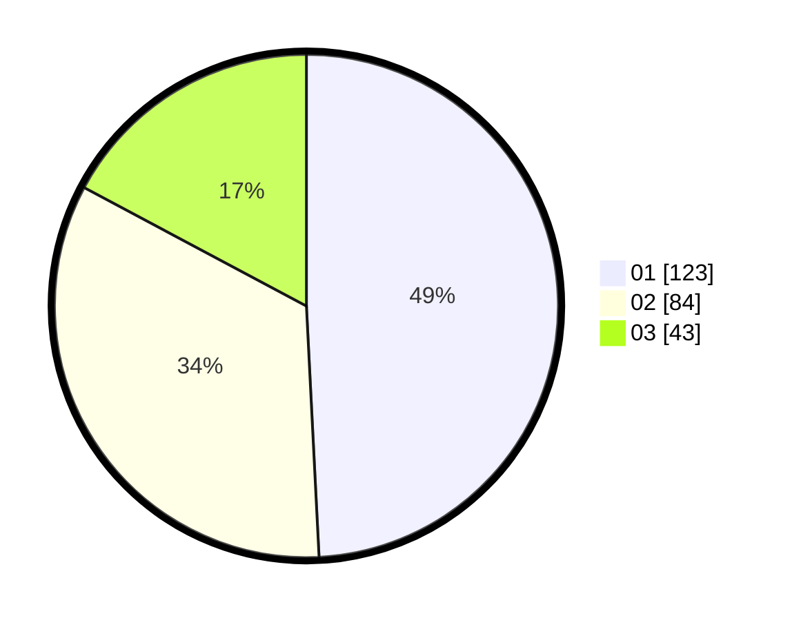

# Hasil

Hasil perolehan suara paslon dapat dilihat pada file paslon-01.txt, paslon-02.txt, dan paslon-03.txt.

Jika tidak ada, artinya data tersebut belum ada pada SIREKAP.

## Perolehan Suara

 * Paslon 01: **123**.
 * Paslon 02: **84**.
 * Paslon 03: **43**.

## Foto C Plano

https://sirekap-obj-formc.kpu.go.id/9b64/pemilu/ppwp/31/75/07/10/01/3175071001120-20240214-155906--8ef7aeac-520a-4983-b738-84e3f8ac4b1f.jpg

https://sirekap-obj-formc.kpu.go.id/9b64/pemilu/ppwp/31/75/07/10/01/3175071001120-20240214-160143--40a321be-eb63-4d2f-ad66-6a4bda5e3d73.jpg

https://sirekap-obj-formc.kpu.go.id/9b64/pemilu/ppwp/31/75/07/10/01/3175071001120-20240214-202016--7b028c6e-87e3-4285-8260-4d72390107b6.jpg

## DATA PEMILIH TETAP

Jumlah pemilih dalam DPT: **286**.
 * L: **128**.
 * P: **158**.

## DATA PENGGUNA HAK PILIH

Jumlah pengguna hak pilih dalam DPT: **251**.
 * L: **108**.
 * P: **143**.

Jumlah pengguna hak pilih dalam DPTb: **0**.
 * L: **0**.
 * P: **0**.

Jumlah pengguna hak pilih dalam DPK: **1**.
 * L: **0**.
 * P: **1**.

Jumlah pengguna hak pilih: **252**.
 * L: **108**.
 * P: **144**.

## JUMLAH SUARA SAH DAN TIDAK SAH

JUMLAH SELURUH SUARA SAH: **250**.

JUMLAH SUARA TIDAK SAH: **2**.

JUMLAH SELURUH SUARA SAH DAN SUARA TIDAK SAH: **252**.
