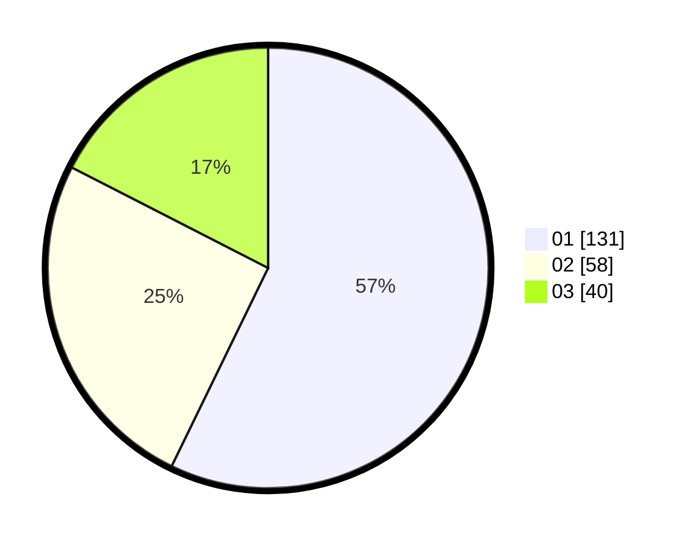

# Hasil

Hasil perolehan suara paslon dapat dilihat pada file paslon-01.txt, paslon-02.txt, dan paslon-03.txt.

Jika tidak ada, artinya data tersebut belum ada pada SIREKAP.

## Perolehan Suara

 * Paslon 01: **131**.
 * Paslon 02: **58**.
 * Paslon 03: **40**.

## Foto C Plano

https://sirekap-obj-formc.kpu.go.id/871b/pemilu/ppwp/31/75/07/10/01/3175071001123-20240215-001543--a08a4ab8-4ad5-45e3-8cfb-c05c1423697f.jpg

https://sirekap-obj-formc.kpu.go.id/871b/pemilu/ppwp/31/75/07/10/01/3175071001123-20240214-231229--e3059150-f717-48d8-a258-ed41e9c3910d.jpg

https://sirekap-obj-formc.kpu.go.id/871b/pemilu/ppwp/31/75/07/10/01/3175071001123-20240214-231342--f34e9273-a8f8-4e2c-b01e-4e1870941787.jpg
