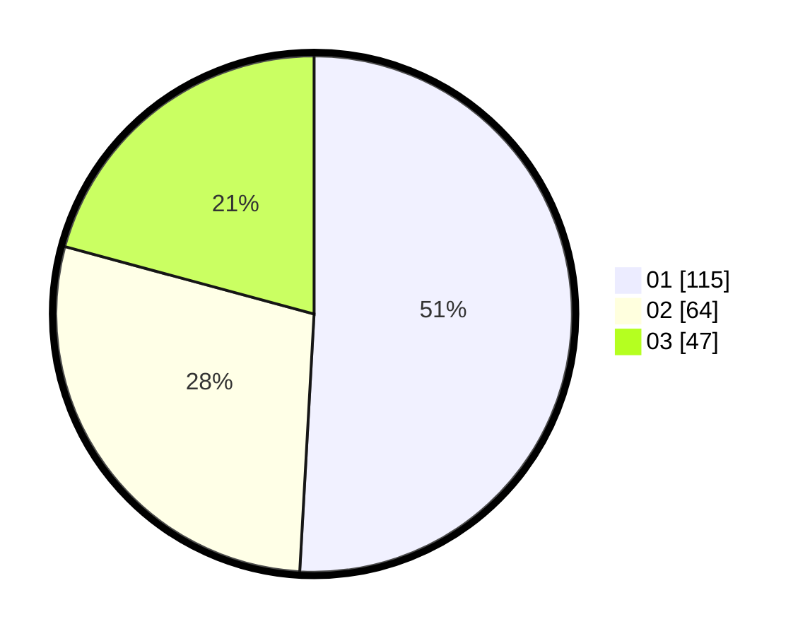

# Hasil

Hasil perolehan suara paslon dapat dilihat pada file paslon-01.txt, paslon-02.txt, dan paslon-03.txt.

Jika tidak ada, artinya data tersebut belum ada pada SIREKAP.

## Perolehan Suara

 * Paslon 01: **115**.
 * Paslon 02: **64**.
 * Paslon 03: **47**.

## Foto C Plano

https://sirekap-obj-formc.kpu.go.id/6630/pemilu/ppwp/31/75/07/10/01/3175071001125-20240214-190727--97e10f38-3968-421d-b7e8-307c17e4540e.jpg

https://sirekap-obj-formc.kpu.go.id/6630/pemilu/ppwp/31/75/07/10/01/3175071001125-20240214-190817--0389bf87-3764-49d3-9276-9f20406e130f.jpg

https://sirekap-obj-formc.kpu.go.id/6630/pemilu/ppwp/31/75/07/10/01/3175071001125-20240214-190900--f6a6b466-93df-4802-80c4-3eeaa3585f44.jpg

## DATA PEMILIH TETAP

Jumlah pemilih dalam DPT: **274**.
 * L: **131**.
 * P: **143**.

## DATA PENGGUNA HAK PILIH

Jumlah pengguna hak pilih dalam DPT: **225**.
 * L: **107**.
 * P: **118**.

Jumlah pengguna hak pilih dalam DPTb: **1**.
 * L: **0**.
 * P: **1**.

Jumlah pengguna hak pilih dalam DPK: **0**.
 * L: **0**.
 * P: **0**.

Jumlah pengguna hak pilih: **226**.
 * L: **107**.
 * P: **119**.

## JUMLAH SUARA SAH DAN TIDAK SAH

JUMLAH SELURUH SUARA SAH: **226**.

JUMLAH SUARA TIDAK SAH: **0**.

JUMLAH SELURUH SUARA SAH DAN SUARA TIDAK SAH: **226**.
