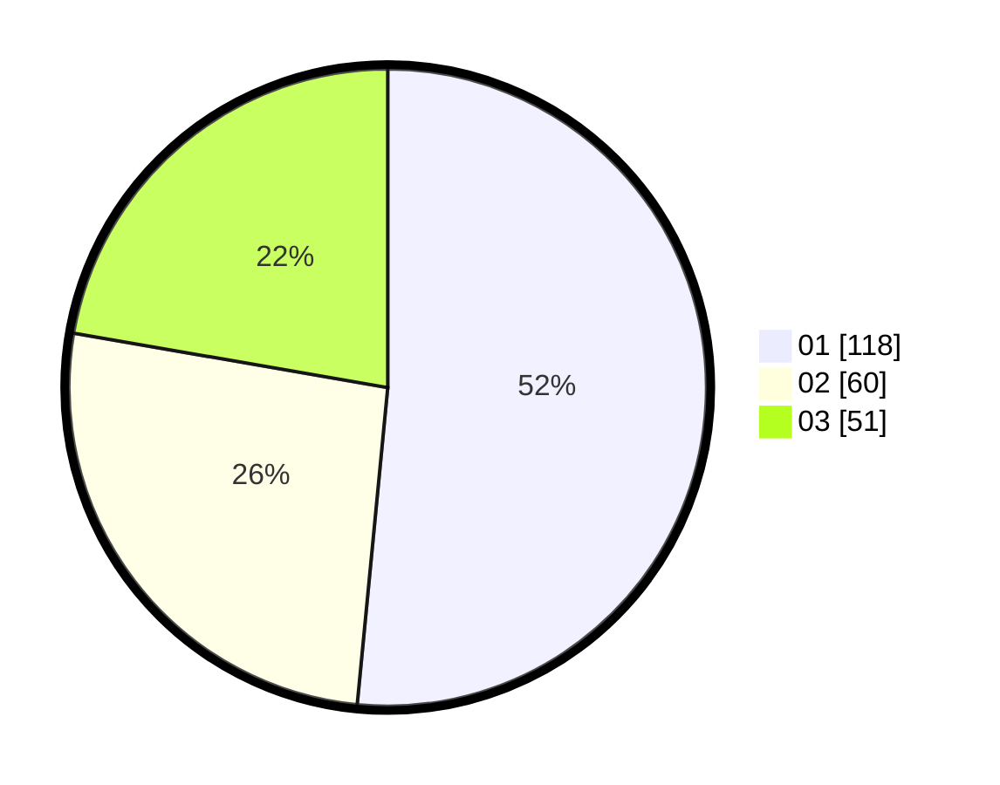

# Hasil

Hasil perolehan suara paslon dapat dilihat pada file paslon-01.txt, paslon-02.txt, dan paslon-03.txt.

Jika tidak ada, artinya data tersebut belum ada pada SIREKAP.

## Perolehan Suara

 * Paslon 01: **118**.
 * Paslon 02: **60**.
 * Paslon 03: **51**.

## Foto C Plano

https://sirekap-obj-formc.kpu.go.id/193d/pemilu/ppwp/31/75/07/10/01/3175071001129-20240214-193654--9a6daf44-1103-40be-b1d0-26ea07b0f248.jpg

https://sirekap-obj-formc.kpu.go.id/193d/pemilu/ppwp/31/75/07/10/01/3175071001129-20240214-193807--770d0426-04e9-4ece-89f6-4ecc45786120.jpg

https://sirekap-obj-formc.kpu.go.id/193d/pemilu/ppwp/31/75/07/10/01/3175071001129-20240214-195249--6aafb0cf-9c98-4a1b-9e2e-f8634c99ac16.jpg

## DATA PEMILIH TETAP

Jumlah pemilih dalam DPT: **269**.
 * L: **136**.
 * P: **133**.

## DATA PENGGUNA HAK PILIH

Jumlah pengguna hak pilih dalam DPT: **230**.
 * L: **116**.
 * P: **114**.

Jumlah pengguna hak pilih dalam DPTb: **5**.
 * L: **3**.
 * P: **2**.

Jumlah pengguna hak pilih dalam DPK: **0**.
 * L: **0**.
 * P: **0**.

Jumlah pengguna hak pilih: **235**.
 * L: **119**.
 * P: **116**.

## JUMLAH SUARA SAH DAN TIDAK SAH

JUMLAH SELURUH SUARA SAH: **229**.

JUMLAH SUARA TIDAK SAH: **6**.

JUMLAH SELURUH SUARA SAH DAN SUARA TIDAK SAH: **235**.
