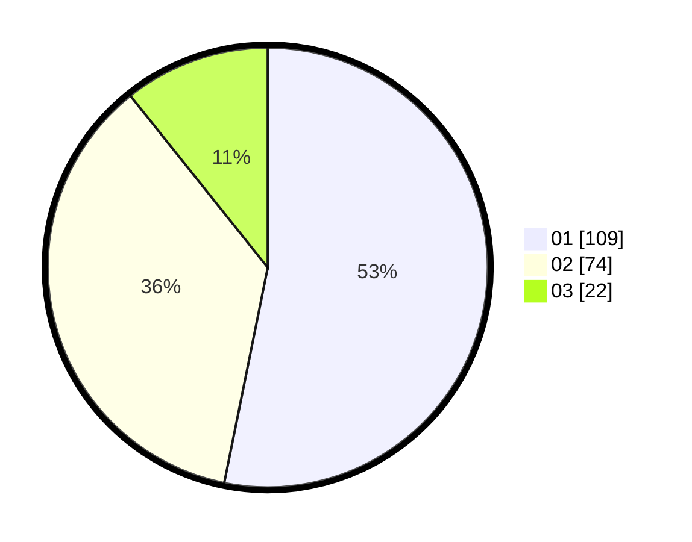

# Hasil

Hasil perolehan suara paslon dapat dilihat pada file paslon-01.txt, paslon-02.txt, dan paslon-03.txt.

Jika tidak ada, artinya data tersebut belum ada pada SIREKAP.

## Perolehan Suara

 * Paslon 01: **109**.
 * Paslon 02: **74**.
 * Paslon 03: **22**.

## Foto C Plano

https://sirekap-obj-formc.kpu.go.id/c956/pemilu/ppwp/31/75/07/10/01/3175071001134-20240215-014926--3e3ce25e-fd59-4aff-a084-32c4ca5ba5e8.jpg

https://sirekap-obj-formc.kpu.go.id/c956/pemilu/ppwp/31/75/07/10/01/3175071001134-20240215-014941--f62a46ca-99a2-4bf7-9b09-c6db4f7fb7e4.jpg

https://sirekap-obj-formc.kpu.go.id/c956/pemilu/ppwp/31/75/07/10/01/3175071001134-20240215-014957--61f9c2a9-4e08-4be9-8ec0-615577a234fd.jpg

## DATA PEMILIH TETAP

Jumlah pemilih dalam DPT: **268**.
 * L: **128**.
 * P: **140**.

## DATA PENGGUNA HAK PILIH

Jumlah pengguna hak pilih dalam DPT: **203**.
 * L: **91**.
 * P: **112**.

Jumlah pengguna hak pilih dalam DPTb: **2**.
 * L: **2**.
 * P: **0**.

Jumlah pengguna hak pilih dalam DPK: **2**.
 * L: **2**.
 * P: **0**.

Jumlah pengguna hak pilih: **207**.
 * L: **95**.
 * P: **112**.

## JUMLAH SUARA SAH DAN TIDAK SAH

JUMLAH SELURUH SUARA SAH: **205**.

JUMLAH SUARA TIDAK SAH: **2**.

JUMLAH SELURUH SUARA SAH DAN SUARA TIDAK SAH: **207**.
