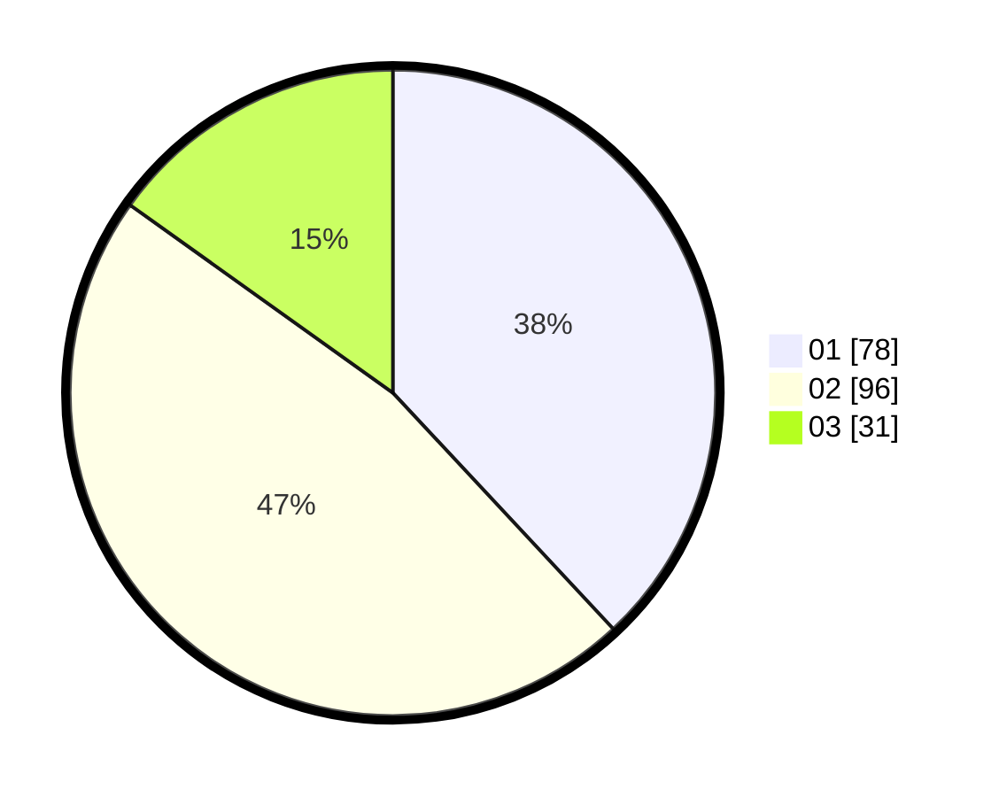

# Hasil

Hasil perolehan suara paslon dapat dilihat pada file paslon-01.txt, paslon-02.txt, dan paslon-03.txt.

Jika tidak ada, artinya data tersebut belum ada pada SIREKAP.

## Perolehan Suara

 * Paslon 01: **78**.
 * Paslon 02: **96**.
 * Paslon 03: **31**.

## Foto C Plano

https://sirekap-obj-formc.kpu.go.id/f4e1/pemilu/ppwp/31/75/07/10/01/3175071001139-20240216-184116--f24b8be4-1a94-41f4-93cd-d94a9c0d17a8.jpg

https://sirekap-obj-formc.kpu.go.id/f4e1/pemilu/ppwp/31/75/07/10/01/3175071001139-20240216-184117--7081a01a-c7d0-487e-883f-bedff6074d7d.jpg

https://sirekap-obj-formc.kpu.go.id/f4e1/pemilu/ppwp/31/75/07/10/01/3175071001139-20240216-184117--f4810cf1-69c4-4e61-944e-7c48c8bb3dad.jpg

## DATA PEMILIH TETAP

Jumlah pemilih dalam DPT: **265**.
 * L: **138**.
 * P: **127**.

## DATA PENGGUNA HAK PILIH

Jumlah pengguna hak pilih dalam DPT: **200**.
 * L: **94**.
 * P: **106**.

Jumlah pengguna hak pilih dalam DPTb: **5**.
 * L: **0**.
 * P: **5**.

Jumlah pengguna hak pilih dalam DPK: **1**.
 * L: **1**.
 * P: **0**.

Jumlah pengguna hak pilih: **206**.
 * L: **95**.
 * P: **111**.

## JUMLAH SUARA SAH DAN TIDAK SAH

JUMLAH SELURUH SUARA SAH: **205**.

JUMLAH SUARA TIDAK SAH: **1**.

JUMLAH SELURUH SUARA SAH DAN SUARA TIDAK SAH: **206**.
