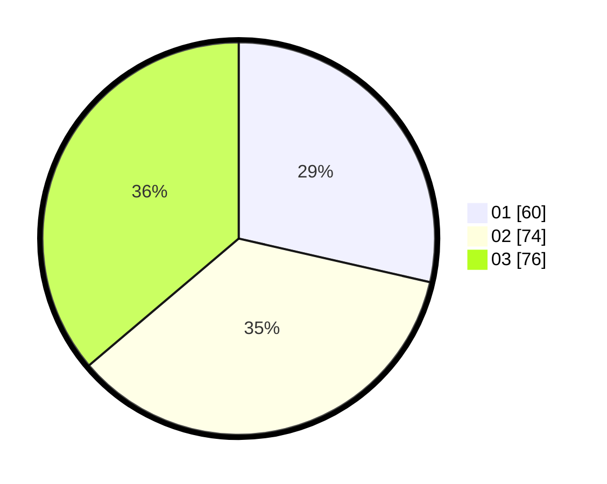

# Hasil

Hasil perolehan suara paslon dapat dilihat pada file paslon-01.txt, paslon-02.txt, dan paslon-03.txt.

Jika tidak ada, artinya data tersebut belum ada pada SIREKAP.

## Perolehan Suara

 * Paslon 01: **60**.
 * Paslon 02: **74**.
 * Paslon 03: **76**.

## Foto C Plano

https://sirekap-obj-formc.kpu.go.id/2b4c/pemilu/ppwp/31/75/07/10/01/3175071001145-20240214-232433--f82b3eee-0bd7-4926-9f35-200318edcee7.jpg

https://sirekap-obj-formc.kpu.go.id/2b4c/pemilu/ppwp/31/75/07/10/01/3175071001145-20240214-232454--4b642150-971d-4cc5-941a-c6b5da33968a.jpg

https://sirekap-obj-formc.kpu.go.id/2b4c/pemilu/ppwp/31/75/07/10/01/3175071001145-20240214-232515--b2159585-e01e-4397-9984-ecd7f5f98fb7.jpg
