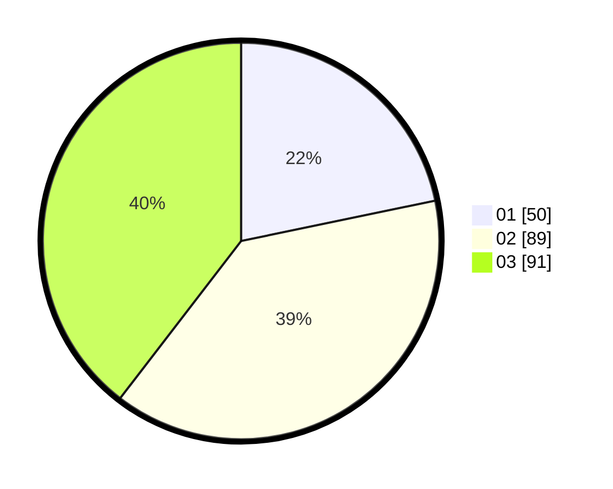

# Hasil

Hasil perolehan suara paslon dapat dilihat pada file paslon-01.txt, paslon-02.txt, dan paslon-03.txt.

Jika tidak ada, artinya data tersebut belum ada pada SIREKAP.

## Perolehan Suara

 * Paslon 01: **50**.
 * Paslon 02: **89**.
 * Paslon 03: **91**.

## Foto C Plano

https://sirekap-obj-formc.kpu.go.id/208f/pemilu/ppwp/31/75/07/10/01/3175071001146-20240214-230113--8a6104e6-229d-44b7-b21e-227dfe2d82e3.jpg

https://sirekap-obj-formc.kpu.go.id/208f/pemilu/ppwp/31/75/07/10/01/3175071001146-20240214-230141--b84baa99-b44b-4598-9626-f299d087ea46.jpg

https://sirekap-obj-formc.kpu.go.id/208f/pemilu/ppwp/31/75/07/10/01/3175071001146-20240214-230207--426912a4-58b1-4d44-85f8-a584b0e31451.jpg
