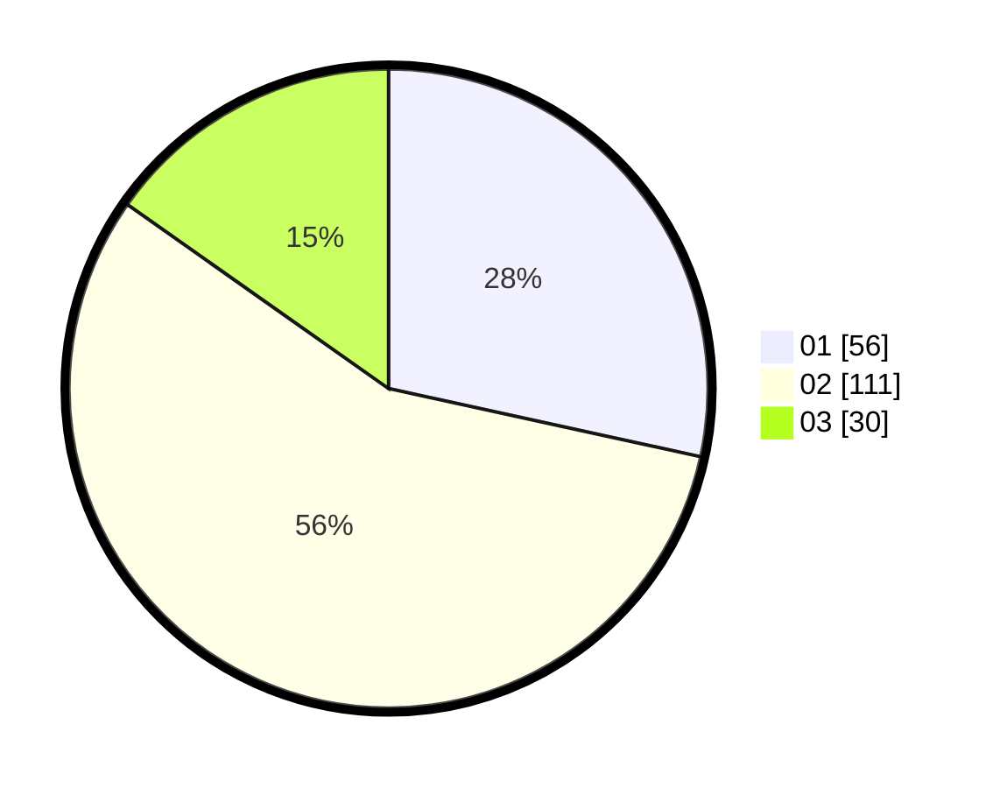

# Hasil

Hasil perolehan suara paslon dapat dilihat pada file paslon-01.txt, paslon-02.txt, dan paslon-03.txt.

Jika tidak ada, artinya data tersebut belum ada pada SIREKAP.

## Perolehan Suara

 * Paslon 01: **56**.
 * Paslon 02: **111**.
 * Paslon 03: **30**.

## Foto C Plano

https://sirekap-obj-formc.kpu.go.id/5316/pemilu/ppwp/31/75/07/10/01/3175071001147-20240214-212555--3ca29648-accb-4a48-952a-e4bf825c2b91.jpg

https://sirekap-obj-formc.kpu.go.id/5316/pemilu/ppwp/31/75/07/10/01/3175071001147-20240214-212629--67af22ff-67f9-4226-a8b8-5846ca74d1cf.jpg

https://sirekap-obj-formc.kpu.go.id/5316/pemilu/ppwp/31/75/07/10/01/3175071001147-20240214-212713--12b20dcd-f552-4c8d-afd4-3c03057c373b.jpg

## DATA PEMILIH TETAP

Jumlah pemilih dalam DPT: **263**.
 * L: **132**.
 * P: **131**.

## DATA PENGGUNA HAK PILIH

Jumlah pengguna hak pilih dalam DPT: **201**.
 * L: **102**.
 * P: **99**.

Jumlah pengguna hak pilih dalam DPTb: **0**.
 * L: **0**.
 * P: **0**.

Jumlah pengguna hak pilih dalam DPK: **0**.
 * L: **0**.
 * P: **0**.

Jumlah pengguna hak pilih: **201**.
 * L: **102**.
 * P: **99**.

## JUMLAH SUARA SAH DAN TIDAK SAH

JUMLAH SELURUH SUARA SAH: **197**.

JUMLAH SUARA TIDAK SAH: **4**.

JUMLAH SELURUH SUARA SAH DAN SUARA TIDAK SAH: **201**.
