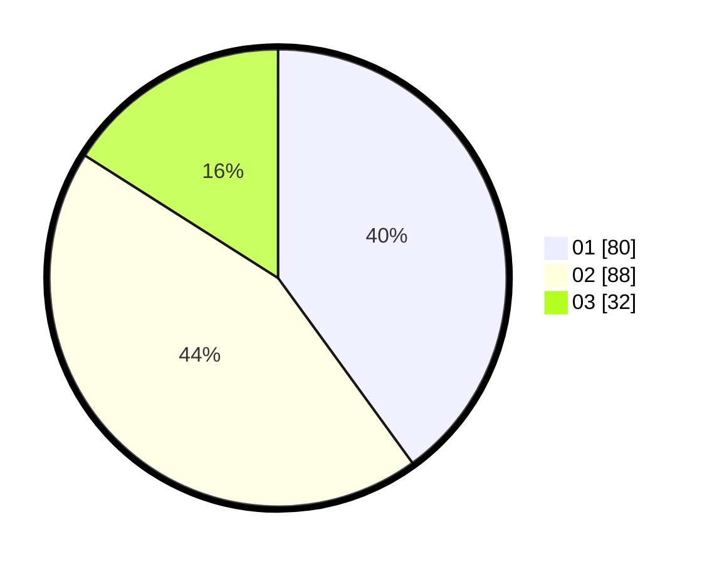

# Hasil

Hasil perolehan suara paslon dapat dilihat pada file paslon-01.txt, paslon-02.txt, dan paslon-03.txt.

Jika tidak ada, artinya data tersebut belum ada pada SIREKAP.

## Perolehan Suara

 * Paslon 01: **80**.
 * Paslon 02: **88**.
 * Paslon 03: **32**.

## Foto C Plano

https://sirekap-obj-formc.kpu.go.id/f3fb/pemilu/ppwp/31/75/07/10/01/3175071001158-20240214-224216--9f7a2bbd-7191-467f-81a7-401b84423099.jpg

https://sirekap-obj-formc.kpu.go.id/f3fb/pemilu/ppwp/31/75/07/10/01/3175071001158-20240214-224233--757d8b1c-08b2-4d3a-b432-e5fcadadafec.jpg

https://sirekap-obj-formc.kpu.go.id/f3fb/pemilu/ppwp/31/75/07/10/01/3175071001158-20240214-224252--8a5110be-02b1-4fb7-8b76-f8ff72e6695b.jpg

## DATA PEMILIH TETAP

Jumlah pemilih dalam DPT: **271**.
 * L: **145**.
 * P: **126**.

## DATA PENGGUNA HAK PILIH

Jumlah pengguna hak pilih dalam DPT: **205**.
 * L: **102**.
 * P: **103**.

Jumlah pengguna hak pilih dalam DPTb: **0**.
 * L: **0**.
 * P: **0**.

Jumlah pengguna hak pilih dalam DPK: **1**.
 * L: **0**.
 * P: **1**.

Jumlah pengguna hak pilih: **206**.
 * L: **102**.
 * P: **104**.

## JUMLAH SUARA SAH DAN TIDAK SAH

JUMLAH SELURUH SUARA SAH: **200**.

JUMLAH SUARA TIDAK SAH: **6**.

JUMLAH SELURUH SUARA SAH DAN SUARA TIDAK SAH: **206**.
