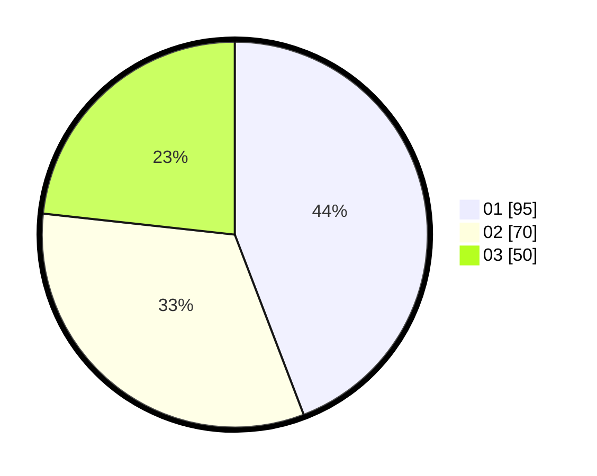

# Hasil

Hasil perolehan suara paslon dapat dilihat pada file paslon-01.txt, paslon-02.txt, dan paslon-03.txt.

Jika tidak ada, artinya data tersebut belum ada pada SIREKAP.

## Perolehan Suara

 * Paslon 01: **95**.
 * Paslon 02: **70**.
 * Paslon 03: **50**.

## Foto C Plano

https://sirekap-obj-formc.kpu.go.id/6310/pemilu/ppwp/31/75/07/10/01/3175071001167-20240215-011157--8cbc5c27-061a-4c45-b774-a10631bb1ff4.jpg

https://sirekap-obj-formc.kpu.go.id/6310/pemilu/ppwp/31/75/07/10/01/3175071001167-20240215-010440--a506162b-9db8-44da-a1e5-bb44a4f4412d.jpg

https://sirekap-obj-formc.kpu.go.id/6310/pemilu/ppwp/31/75/07/10/01/3175071001167-20240215-010613--c085549d-ea7e-42fb-a787-101b1982d45e.jpg
